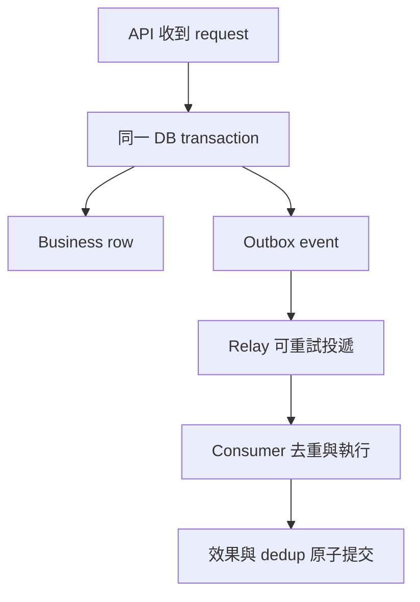
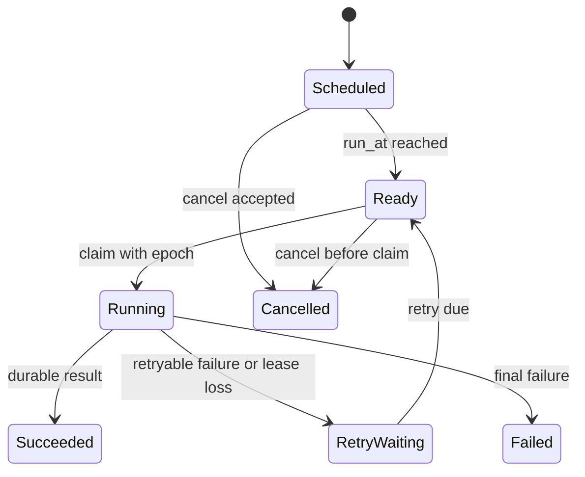

# Distributed Systems 完整手冊

SRE · Production Engineering · Infrastructure Engineering  
為 ChengDe 編寫｜2026 年 9 月 15 日｜從基礎到故障下的工程判斷

這本書把「分散式系統聖經」定位為你能持續查閱、練習與補強的工程手冊：理解保證的邊界，分析 failure scenarios，做出可解釋的 trade-offs。你已用過 PostgreSQL、Redis、RabbitMQ、Kubernetes，也設計過 cache、rate limiter、URL shortener；本書把這些經驗串成系統化知識。

它涵蓋一般 SRE／infrastructure 面試與實務所需的主要原理，不以背整張 system design 架構圖為目標。正式形式化證明、Byzantine consensus、資料庫 optimizer 與研究前沿不是此書主線；遇到這些議題時，文中會給你正確的切入點。

**章節導航**

- [1 如何讀以及本書依據](#1-如何讀以及本書依據)
- [2 先從 Failure Model 開始](#2-先從-failure-model-開始)
- [3 Requirements NFR 與可計算的目標](#3-requirements-nfr-與可計算的目標)
- [4 Time Ordering 與 Causality](#4-time-ordering-與-causality)
- [5 Consistency Models 要用 History 理解](#5-consistency-models-要用-history-理解)
- [6 CAP PACELC 與 FLP](#6-cap-pacelc-與-flp)
- [7 Replication 與 Acknowledgment](#7-replication-與-acknowledgment)
- [8 Quorum 的算式與限制](#8-quorum-的算式與限制)
- [9 Consensus Raft 與 Replicated State Machine](#9-consensus-raft-與-replicated-state-machine)
- [10 Lease Distributed Lock 與 Fencing](#10-lease-distributed-lock-與-fencing)
- [11 Partitioning Sharding 與 Rebalancing](#11-partitioning-sharding-與-rebalancing)
- [12 Storage Engines WAL 與 Data Lifecycle](#12-storage-engines-wal-與-data-lifecycle)
- [13 Transactions Isolation 與 Invariants](#13-transactions-isolation-與-invariants)
- [14 Distributed Transaction 2PC Saga 與 Outbox](#14-distributed-transaction-2pc-saga-與-outbox)
- [15 Messaging Delivery 與 Exactly Once](#15-messaging-delivery-與-exactly-once)
- [16 Idempotency 與 API State Machine](#16-idempotency-與-api-state-machine)
- [17 Cache 的一致性與故障保護](#17-cache-的一致性與故障保護)
- [18 Overload Queue 與 Retry](#18-overload-queue-與-retry)
- [19 Coordination Gossip 與 Conflict Resolution](#19-coordination-gossip-與-conflict-resolution)
- [20 Multi Region 與 Disaster Recovery](#20-multi-region-與-disaster-recovery)
- [21 Distributed Job Scheduler 的完整骨架](#21-distributed-job-scheduler-的完整骨架)
- [22 Observability Deployment 與 Automation](#22-observability-deployment-與-automation)
- [23 六個跨系統案例](#23-六個跨系統案例)
- [24 Trade Off 速查表](#24-trade-off-速查表)
- [25 三個可驗證的推理實驗](#25-三個可驗證的推理實驗)
- [26 三十題口試與答案要點](#26-三十題口試與答案要點)
- [27 三場模擬面試與自評](#27-三場模擬面試與自評)
- [28 最後複習與後續深讀](#28-最後複習與後續深讀)

## 1 如何讀以及本書依據

### 1.1 三層閱讀

| 層級 | 章節 | 讀完應能做什麼 |
|---|---|---|
| 核心 | 2–10 | 解釋 failure、consistency、replication、quorum、consensus、fencing |
| 實作 | 11–19 | 選 storage／transaction／messaging／cache／overload 機制 |
| 系統判斷 | 20–28 | 做 multi-region recovery、scheduler、案例推理與驗收 |

可分成 8–12 個約一小時學習時段，再做實驗與口試。這是安排建議，真正進度看你能否自行解釋，不能只以閱讀速度判斷。

每章練三句話：**我在保護什麼 invariant；允許什麼 failure；為此付出什麼 latency、availability 或操作成本。**

### 1.2 資料與證據

學科範圍參考 MIT distributed systems 課程；原理核對 CAP、FLP、Lamport clocks、Raft、Dynamo 等原始論文；產品行為以 PostgreSQL、etcd、RabbitMQ、Kafka、Redis 文件為準。MIT 課綱支持 breadth，不是 Apple 考綱。[MIT 6.5840](https://pdos.csail.mit.edu/6.824/schedule.html)

HM 目前明確點名 OS、Network，尚未確認下一輪一定考本書每個領域。本書的優先次序、案例、演算與 readiness gate 是為你設計的學習工具；不是已知原題或錄取保證。正文在技術相關位置附連結，避免用二手面經解釋協議正確性。

## 2 先從 Failure Model 開始

### 2.1 分散式為什麼困難

單機程式常能依 memory state 與 call return 判斷進度；跨機器後，對方可能執行了卻回不到答案，也可能根本沒收到。Machine、network、process、disk、clock 可以分別故障，且觀測常延遲。

| Failure | 表現 | 必須考慮 |
|---|---|---|
| crash-stop | process 停止且不回來 | replica 接手 |
| crash-recovery | 停止後重啟 | 哪些 state 是 durable；是否還有舊身份 |
| omission／packet loss | request 或 response 遺失 | retry、duplicate、unknown outcome |
| delay／pause | GC、CPU starvation、慢 disk、network delay | timeout 可能誤判 |
| partition | 部分節點互相不能通信 | 誰仍能讀寫；如何避免衝突 |
| corruption／Byzantine | 錯誤甚至互相矛盾的行為 | 一般 crash-tolerant protocol 不一定保護 |
| correlated failure | 同 zone、同版本、同依賴一起壞 | replicas 的獨立性不能只看數量 |

一般 SRE 面試先假設 non-Byzantine，但應說出 checksum、資料驗證與故障域仍重要。多放三台同一 host 上的 replica，不能容忍該 host 消失。

### 2.2 Timeout 的三種可能

假設 client 送出「建立訂單」，等待後 timeout：

1. Request 沒送到，訂單沒建立。
2. Request 到了但尚未完成。
3. 訂單已 durable commit，response 遺失。

同一個 timeout 無法區分三者。正確做法是有 stable request ID／idempotency key、可查 status 的介面與可重試的 protocol；不能把所有 timeout 都顯示成「已取消」。

**英文口試**

> A timeout tells me that the caller did not receive a result within its deadline. It does not prove that the operation failed. I would design for an unknown outcome using a stable operation identifier, idempotent retries, and a way to query the durable result.

### 2.3 Safety 與 liveness

Safety：不發生不允許的事，例如同一資源被重複授權給衝突工作。Liveness：合法工作最終能前進。Partition 時停止部分 writes 可能保 safety 卻犧牲當下 liveness；一直讓兩邊寫則可能接受衝突。先指出 invariant，才能說何者可犧牲。

## 3 Requirements NFR 與可計算的目標

### 3.1 先定義成功

不要只說 high availability、low latency。用具體 operation 定義：create 是否 durable、讀可 stale 多久、schedule 最晚多久觸發、重複 job 是否允許、刪除後可否再讀到資料。

| 維度 | 要問的問題 | 範例答案形式 |
|---|---|---|
| correctness | 哪件事絕不能錯 | 同一 job occurrence 不能重複產生不可逆 side effect |
| latency | 哪個 percentile、哪段路徑 | region-local GET p99 10 ms，不含 public internet |
| availability | 哪些 operation 算成功 | 讀不到就返回 stale 算不算成功 |
| durability | 哪些 failures 下承諾保存 | 已 ack 寫入是否容忍一台／一個 zone 故障 |
| consistency | 哪些觀察必須成立 | 建立後自己立刻查得到；權限撤銷不可繼續授權 |
| scale | 平均／尖峰、資料量、hot keys | write 1k/s，burst 5 倍，top key 佔 20% |
| recovery | RPO／RTO | 最多丟多久資料，多久恢復有效服務 |

RPO 是可接受的資料恢復點落後程度，RTO 是恢復服務的目標時間。RPO=0 需要明確 failure model 與 commit/durability 設計，不能靠「我們有 backup」得到。

### 3.2 快速計算

自編例子：每天 8,640 萬 requests，平均 1,000 RPS；peak factor 5，尖峰 5,000 RPS。每筆 durable record 500 bytes、每天新增 100 萬筆，一年 raw data 約 182.5 GB，之後再加 indexes、replication、metadata 與 headroom。

Little's Law 在適用的穩定系統中是 L＝λW。若完成 throughput 2,000/s、平均 in-system time 0.2s，平均約 400 個 in-flight requests。這不是「把 pool 固定設 400」的直接公式；queue 與 service time、downstream capacity、burst 都要分開。

自編 SLO 計算：30 天共 43,200 分鐘，時間型 99.9% availability 對應 43.2 分鐘 budget。Request-based SLO 則依 eligible requests 算，不可與 downtime minutes 混為一談。

## 4 Time Ordering 與 Causality

Wall clock 用來對人顯示時間，但可能 drift／被調整；monotonic clock 適合單機 elapsed time，但不同機器的 monotonic values 不能直接相減形成全球排序。

Lamport clock 讓 happens-before 關係能反映在 logical timestamps：若 A causally precedes B，則 L(A)<L(B)；反向不成立，timestamp 大不能證明兩件事有 causality。Vector clock 可表達更多因果與 concurrent 關係，代價是 metadata 規模與成員管理。[Lamport 原始論文](https://www.microsoft.com/en-us/research/publication/time-clocks-ordering-events-distributed-system/)

**例子：**台北與新加坡各自把同一 document 改名，兩邊沒有看過對方的寫入，這是 concurrent writes；如果只比 wall-clock timestamp 做 last-write-wins，較快的時鐘可能贏，不代表那是業務想保留的版本。

Logical revision／sequence number 可表示同一 authority 或 log 內的順序；跨不同 leaders／shards 是否可比較，要看生成規則。Snowflake 類 ID 的時間部分也需要處理 clock rollback、worker ID 重複與範圍限制。

Spanner 顯示有界 clock uncertainty 可與 protocol 結合，提供強交易保證；這不表示一般裝了 NTP 的 hosts 就具備相同能力。[Spanner](https://research.google/pubs/spanner-googles-globally-distributed-database/)

## 5 Consistency Models 要用 History 理解

### 5.1 一次寫入後別人可以看到什麼

| Model／guarantee | 你可依賴什麼 | 還不保證什麼 |
|---|---|---|
| linearizability | operation 看似在 invocation 與 response 之間某點原子生效，保 real-time order | 不自動把多個獨立 operations 組成 transaction |
| sequential consistency | 存在保留每個 process program order 的單一順序 | 不必保真實時間的先後 |
| causal consistency | 有因果的 operations 順序不顛倒 | concurrent writes 可有不同觀察順序 |
| eventual consistency | 在停止新更新、通信與修復等前提下最終收斂 | 不自動提供有限 stale 上限或 read-your-writes |
| read-your-writes | 同一 session 之後能看到自己的寫入 | 不代表其他 clients 立刻看得到 |
| monotonic reads | 同一 session 不往較舊版本退回 | 不代表每次都是全球最新 |

這些是不同保證，不能只說「strong／weak」就結束。Jepsen 的 consistency taxonomy 提供各種模型的關係；實際產品應再核對 operation-level contract。[Jepsen consistency](https://jepsen.io/consistency)

### 5.2 自編 History

初始 x=0。A 的 `write(x=1)` 已回成功；之後 B 才呼叫 `read(x)`，卻得到 0。若寫與讀都在宣稱的同一 linearizable object 範圍，這違反 linearizability。若 B 的 read 早在 write 完成前就開始，兩者 overlap，答案不同並不一定違反。

Read-your-writes 可透過讀 primary、session pinning，或攜帶 last-seen revision 並等 replica catch up 實作。只寫「sticky session」還不夠：session 對到的 backend 是否真持有該 revision？Failover 後 token 如何延續？

### 5.3 Linearizable 與 serializable 不一樣

Serializability 是多個 transactions 的效果等價某個 serial execution，單獨不要求真實時間順序。Strict serializability 同時要求相應 real-time constraint。資料庫的 isolation 與 replicas 讀新鮮度也不是同一個開關。

**英文口試**

> I would state the consistency requirement as an observable behavior. For example, once a write returns successfully, every later read of that object must see that write or a newer one. That is stronger than eventual convergence, and it affects how we acknowledge writes, serve reads, and handle failover.

## 6 CAP PACELC 與 FLP

### 6.1 CAP 不是平常任選兩個

在 network partition 的條件下，一般無法同時保證 linearizable consistency 與 CAP 所定義的 availability。該 availability 要求每個發到 non-failing node 的 request 最終取得符合模型的 response，不等於你 dashboard 上的 99.99% SLO。[Gilbert 與 Lynch CAP 論文](https://users.ece.cmu.edu/~adrian/731-sp04/readings/GL-cap.pdf)

**自編例子：**A、B disconnected，都存最後一張票。若兩邊都允許售出，就可能破壞不可超賣 invariant；若只授權其中一側，另一側 client 就無法完成售票。若先把不同票的 ownership 分配給兩邊，可以讓兩邊賣各自配額，但不是同一份未分配共享庫存都可自由扣。

實際服務可依 operation 選行為：catalog stale read 繼續、inventory decrement 限制 owner／quorum、analytics 延後。不要把整個含多種功能的產品永久貼成單一 CP 或 AP。

### 6.2 PACELC

PACELC 提醒：有 partition 時要處理 availability／consistency；即使沒有 partition，正常操作也常在 latency／consistency 間付成本，例如跨 region synchronous writes 增加等待。[Abadi PACELC 論文](https://www.cs.umd.edu/~abadi/papers/abadi-pacelc.pdf)

這是分析 replication 選擇的框架，不是所有 system 的機械分類器。面試要回到 operation、topology、quorum 與 failure assumptions。

### 6.3 FLP

在完全 asynchronous 的模型，即使僅允許一個 process crash，deterministic consensus 也不能保證在所有 executions 都終止。這不表示 consensus 不能實用；實際 systems 依靠適當 timing assumptions、timeouts、randomization 等取得常態下進展。[FLP 原始論文](https://groups.csail.mit.edu/tds/papers/Lynch/jacm85.pdf)

知道的重點：**timeout 不能完美區分慢與死**，所以 protocol 必須在誤判 leader 時仍保 safety。

## 7 Replication 與 Acknowledgment

### 7.1 先說 ack 到哪個階段

一個 write 可以經過：接收、寫入 memory、寫入 local log、local durable flush、replica receive、replica durable flush、replica apply。回成功選在哪一點，決定 crash loss、stale reads、latency 與 availability。

| Ack policy | 優點 | failure 下的風險 |
|---|---|---|
| primary memory | 快 | primary crash 可能連 local durable copy 都沒有 |
| primary durable | 容忍某些 process／reboot 故障 | host／disk 永久失效時 replica 可能未收到 |
| sync 至指定 replicas | 提高相應故障範圍的保存能力 | replica／network slow 影響 writes |
| replica apply 後 | 可配合該 replica 的立即查詢需求 | apply lag 也進入 write latency |

PostgreSQL 的 synchronous replication 有不同等待層次，async replication 可在 failover 丟失尚未傳到 standby 的 acknowledged transactions。這是配置與 failure model 的結果，不是只看「用了 replication」就能判斷。[PostgreSQL standby 與 replication](https://www.postgresql.org/docs/current/warm-standby.html)

### 7.2 Replication topology

Single leader 將 writes 收斂到一個 authority，簡化 order，但需 failover 且有 write bottleneck。Multi-leader 允許多處寫入，利於 regional writes，卻要處理衝突。Leaderless 模型讓 client／coordinator 與一組 replicas 交互，以版本和 repair 處理差異；不代表沒有任何協調。

Replica lag 可來自 network、disk、apply CPU、long transaction 或 backpressure。Lag seconds 不一定足以表示可丟的 business records；也可量 log position gap、oldest pending event、apply throughput。

### 7.3 Failover 問題清單

誰判定故障？誰有權 promote？新 leader 是否包含已承諾的 writes？舊 leader 如何失去 authority？Clients 怎麼找到新 leader？是否需 catch-up／rebuild 舊節點？每一項都要有 protocol，不能只說「replica 接手」。

## 8 Quorum 的算式與限制

固定 replica set 共 N 個，write 成功至少 W responses，read 至少 R responses；`R+W>N` 使 read set 與該 write set 相交，`W>N/2` 使不同 write sets 相交。例 N=3、W=2、R=2；N=5、W=3、R=3。

**交集是必要推理材料，不是自動的最新值保證。** Read 仍要選對版本，concurrent writes 要有 order／conflict rule，未完成 write 可能部分可見，membership 必須一致。部分 quorum 系統若要實作 atomic register，還需要版本協定和 read repair／write-back 等額外步驟。

Sloppy quorum 可暫時寫到正常 replica set 以外的 nodes，提升某些可用性；但原本「同一固定集合」的交集推論不再直接套用。Dynamo 的 availability-oriented 設計還包含 versioning、hinted handoff、repair 等機制。[Dynamo 論文](https://www.allthingsdistributed.com/files/amazon-dynamo-sosp2007.pdf)

### 自編反例

N=3，write v2 只到 A 就 timeout；client 不知道是否成功。Read A、B 可讀到 v2，後來 read B、C 卻讀到 v1。光是「每次讀兩台」不能把這種 partial write exposure 與 read ordering 變成 linearizable。你要說完整 algorithm，不能只報 R=2/W=2。

**英文口試**

> Quorum intersection tells us that the read and write sets overlap under a fixed membership model. It does not by itself guarantee linearizability. We still need correct version ordering, handling of concurrent and incomplete writes, and a safe membership and failover protocol.

## 9 Consensus Raft 與 Replicated State Machine

### 9.1 Consensus 解決什麼

目標是讓節點對一組 decisions／log order 達成一致，常用於 leader metadata、configuration、ownership 或 replicated state machine。Application 依相同的 committed commands deterministic apply，才能維持 state agreement。

Raft 以 terms、leader election、log replication、majority 與 log matching 保 safety。Candidate 要符合相應 log freshness 條件；leader 不能任意因「我曾是 leader」就回應強保證操作。對 current-term entry 的 majority replication 是 commit 規則的重要部分，不能把所有舊 term entries 都只靠任意數數判定已 commit。[Raft 原始論文](https://raft.github.io/raft.pdf)

### 9.2 用一個具體例子推理

三個 voters A、B、C，A 是 leader。A 與 B 可通信，C 斷線，A/B 還有 majority，能依 protocol 前進。若 A 被隔離，B/C 能選新 leader；A 即使尚未知道自己失去角色，也不能依單機自信安全地完成新的 quorum writes。

五個 voters 可在適當通信與 timing 條件下容忍兩個 unavailable；四個 voters majority=3，同樣只容忍一個 unavailable，故 3／5 常見。但地理分布與可失去的 zone 更重要，不能只說奇數就萬無一失。

### 9.3 Reads 為什麼也要注意

舊 leader 可能暫時不知道新的 leader 已選出；直接從其 local state 回「最新」可能 stale。Linearizable reads 需要 protocol 保證目前 authority 與已 apply 的進度，例如 quorum 確認、ReadIndex 類機制或具假設邊界的 lease。etcd 區分 linearizable reads 與可更便宜但可能 stale 的 serializable reads；它的 API 名稱不要混同 DB transaction isolation。[etcd API guarantees](https://etcd.io/docs/v3.6/learning/api_guarantees/)

### 9.4 Consensus 沒幫你處理的事

它不自動讓外部 payment API exactly once，不消除 nondeterministic application bug，不免除 snapshots／log retention，也不保證 minority partition 可寫。Consensus 用在需要共同 authority 的小而關鍵 state；大量 data 常分成多個 shards／groups。

Paxos 也是 consensus 家族；初步需知道 proposal／quorum 與已選值不能被推翻的 safety 思路。一般工程面試先能把 Raft failure case 講清楚，比同時背兩套 protocol 名詞有用。

## 10 Lease Distributed Lock 與 Fencing

### 10.1 Lease 不是遠端 kill switch

Lease 給一段有限時間的使用／ownership 權利，需要 renewal。Heartbeat 沒收到可能是失聯、pause 或 slow；lease 過期不會神奇地讓舊 process 停止所有 instruction。

**自編時間線：**Worker A 取得 lock，開始工作後 pause；lock 過期，B 取得新 lock 並寫入結果；A 恢復，帶著舊資料繼續寫。若 storage 只檢查「曾經拿過 lock」，仍會被舊 owner 覆蓋。

### 10.2 Fencing token

每次 authority 換手發出單調遞增 token。Protected resource 記住已接受的最高 token，在修改時**原子地**拒絕更舊 token。A=41、B=42；B 的操作被接受後，A 的 41 就不能再修改。

Fencing 的作用在 storage／side-effect 執行端，不是只在 lock service 回傳一個數字。如果下游不支援 token／conditional write，你還沒有保護那個外部 side effect。[Kleppmann 的 distributed locking 分析](https://martin.kleppmann.com/2016/02/08/how-to-do-distributed-locking.html)

### 10.3 什麼時候不需要 distributed lock

若可以用 DB unique constraint、conditional update、compare-and-swap 或單一 owner partition 維護 invariant，常比另加 lock service 更直接。Lock 有自身 failure／renewal／expiry 問題。

| 需求 | 優先考慮 |
|---|---|
| 同一 request 只建立一筆 | scoped unique idempotency key |
| 更新不能覆蓋別人版本 | `WHERE version = expected_version` 的 atomic CAS |
| 工作 claim | transaction／conditional update＋lease epoch |
| 外部資源不得接受舊 owner | fencing at resource |
| cache miss 少做重複查詢 | best-effort single-flight；可接受重複計算 |

「節省重複工作」與「維護不可違反的 correctness」需要的 lock 強度不同。不要把 cache stampede lock 的方案直接搬去決定醫療訂單唯一執行。

## 11 Partitioning Sharding 與 Rebalancing

Replication 複製同一份資料以提高容錯／讀能力；partitioning 把不同資料分開以分散容量與負載。兩者通常一起使用：每個 shard 再有自己的 replicas。

| Partition key 方法 | 優點 | 主要風險 |
|---|---|---|
| hash(key) | 一般點查詢分布較均勻 | range query 需 fan-out；hot key 不會自動分散 |
| range | 範圍查詢、locality 較好 | monotonic key 可集中新寫入 |
| directory／explicit mapping | 可依 tenant、容量調整 placement | mapping service 的一致性與更新流程 |
| composite／bucketed key | 可分散某些 hot tenants／time buckets | query 與 aggregation 更複雜 |

Consistent hashing 讓 membership 改變時只需移動部分 key ownership；virtual nodes 有助分配更平滑。另一種是固定大量 logical slots，再把 slots 配到 physical nodes。**兩者解決的都是 placement；不是 consensus，也不是自動修復所有 skew。**

### 11.1 Hot shard 與 hot key

Hot shard 可能包含很多 keys，可 split／move／rebalance。單一 hot key 若必須串行更新，hash 再均勻也只落到同一 authority；要考慮 read replicas、local cache、aggregation、拆成 buckets，或接受該 invariant 的串行限制。

**你的 rate limiter 例子：**global counter 是 hot key。每 gateway 批次取得 quota 可降低 coordination，但要追蹤 outstanding allocation；如果 quota 在 gateway crash 後遺失，通常是浪費 capacity，若被重複回收則可能超發。

### 11.2 Rebalance 不是直接改 hash ring

一個可說明的遷移流程：建立新 placement version，先 copy snapshot，再 catch up writes／delta；確認進度後切換 authority／routing；處理 stale clients 的 redirect／retry，最後在安全條件下清理舊資料。Dual writes 不是免費方案：其中一邊失敗怎麼補、順序如何維持都要設計。

Migration 期間會消耗 disk、network、CPU，可能傷害正常 requests；要限速、監控 lag、分批執行且可 pause。Metadata 的 version／epoch 避免不同 clients 對 ownership 永久分歧。

## 12 Storage Engines WAL 與 Data Lifecycle

### 12.1 B-tree 與 LSM

B-tree 家族常適合 point／range queries 與更新，維持有序 pages；LSM 將 writes 先進 memory structure／log，flush 成 immutable runs，再 compaction。LSM 可把很多 writes 轉為順序 I/O，但付出 read amplification、write amplification、space amplification 與 compaction 管理。

Bloom filter 可用小 metadata 排除「一定不在此集合」的 lookup；標準 Bloom filter 在正確建置／使用前提下可 false positive，不該 false negative。它不是 authoritative existence check。

不要把「LSM write 快」當永遠成立：stalling compaction、hot partition、sync durability policy 都會影響 p99。也不要只看 DB 類別推論 transaction 或 consistency；要看具體產品、版本與配置。

### 12.2 WAL 與 crash recovery

Write-ahead logging 的要點是相關 log 先於相應 data-page 持久化；crash 後可 replay 已記錄修改。這讓 commit 不必每次把所有 data pages flush，可搭配 group commit。WAL 也能配合 backup／archive 做 point-in-time recovery。[PostgreSQL WAL](https://www.postgresql.org/docs/current/wal-intro.html)

Storage layer 的 durable append、replication layer 的 quorum commit、application 的 business completion 是不同階段。面試講「寫進 log 就好了」時，一定補哪個 log、在哪台 machine、flush 到哪裡。

### 12.3 Tombstone TTL 與資料復活

刪除在 replicated system 中可能需要 tombstone，讓晚到的舊值不被當新資料帶回。Tombstone 太早清理、offline replica 很久後回來、repair 不完整，都可能造成 deleted data resurrection。TTL 是資料生命週期規則，不等於多台機器上同一瞬間物理刪除。

Repair 讓 replicas 對齊；compaction 整理實體資料與舊版本；backup 保留歷史恢復點，三者不同。Cassandra 的 Dynamo-oriented architecture 涵蓋 replication、repair、membership 等，可用來對照實作。[Cassandra architecture](https://cassandra.apache.org/doc/latest/cassandra/architecture/dynamo.html)

### 12.4 Replication 不是 backup

誤刪資料可以被忠實複製到所有 replicas。Backup／PITR 提供過去時間點；要實際做 restore drill，確認可用、schema／keys／依賴完整、恢復時間達標。只看到 backup job 綠燈，不代表能恢復服務。

## 13 Transactions Isolation 與 Invariants

### 13.1 ACID 要能拆開

Atomicity：transaction 的 effects 按其規則全有或全無。Consistency：transaction 應維持應用與 DB constraints 指定的合法狀態，不是 CAP 裡的 consistency。Isolation：concurrent transactions 可看到什麼。Durability：成功 commit 的保存保證，仍需明確 failure model／configuration。

### 13.2 Isolation 的具體問題

Dirty read 讀到未 commit 資料；nonrepeatable read 在同 transaction 兩次讀同 row 看到變化；phantom 涉及 query result set 變化；write skew 是兩個 transactions 各改不同 rows，卻共同破壞跨 rows invariant。

PostgreSQL Read Committed 通常每個 statement 取得 snapshot；Repeatable Read 提供 transaction snapshot，但仍可能有 serialization anomalies；Serializable 可能 abort transactions，application 必須能 retry 整個 transaction。不可把不同資料庫同名 isolation level 的所有行為視為完全相同。[PostgreSQL transaction isolation](https://www.postgresql.org/docs/current/transaction-iso.html)

### 13.3 自編醫療值班例子

Invariant：「至少一位醫師 on-call」。A/B 都讀到兩人值班，各自把自己改 off-call，再 commit，最後變零人。兩人改不同 rows，單純每 row 不互相覆蓋仍不夠。

可以用真正保護該 invariant 的 locking／serialization、single authority 或資料模型調整；選 Serializable 時還要實作 transaction retry。僅用 optimistic version per doctor row，未必保護整個群組。

### 13.4 Pessimistic 與 optimistic

Pessimistic locking 先鎖要保護的資料，避免競爭者進入相衝突操作，代價是等待、deadlocks 與長 transaction 的影響。Optimistic concurrency 先計算，再以 version／predicate 原子檢查後更新，競爭少時有效，競爭高會反覆 retry。[PostgreSQL explicit locking](https://www.postgresql.org/docs/current/explicit-locking.html)

**庫存扣減例子：**

```sql
UPDATE inventory
SET available = available - 1
WHERE sku = :sku AND available > 0
RETURNING available;
```

這是 SQL 示意，參數語法依 client 而定。對同一 row 的條件扣減要由 DB 原子執行，依 returned row 判斷成功；但跨不同 DB 的 payment／shipment 尚未被此 statement 交易化。

## 14 Distributed Transaction 2PC Saga 與 Outbox

### 14.1 2PC 的任務

Two-phase commit 用 prepare 與 commit／abort decision，協調 participants 的 transaction outcome。Prepared participant 已承諾具備完成能力，通常持有相應 resources；若 coordinator／decision 不可達，可能進入等待，影響 availability。

2PC 不等於 consensus：前者協調 transaction participants 的 outcome，後者讓一組 nodes 對 decision/log 達成一致。可以用 consensus 複製 coordinator／decision state 改善故障容忍，但所有 business participants 與準備狀態的限制仍要處理。

### 14.2 Saga 的邊界

Saga 是一系列 local transactions 與必要的 compensation。它通常不提供全程 ACID isolation；中間狀態可被其他流程看見，compensation 也可能失敗，需要 retry／manual resolution。Refund 是新的 business action，不是把已發生世界完美倒帶。[AWS saga orchestration](https://docs.aws.amazon.com/prescriptive-guidance/latest/cloud-design-patterns/saga-orchestration.html)

自編例子：reserve inventory → charge payment → create shipment。Shipment 失敗時能 refund／release inventory；但如果 email 已送出，不能「撤回使用者記憶」。要定义 pending／failed／compensating 等對外狀態。

Orchestration 以 durable coordinator 管理進度；choreography 讓 services 依 events 協作。前者流程易追蹤但 controller 要可靠，後者分散 ownership 但全局理解與循環依賴較難。

### 14.3 Transactional outbox

問題：DB commit 成功、publish message 失敗，downstream 不知道；反過來先 publish，DB rollback，downstream 卻以為成功。

Outbox 把 business write 與 event record 放在同一 local transaction；relay／CDC 再投遞 event。Relay 發送成功但標記進度前 crash，仍可重送，所以 consumer 要 idempotent。它消除特定 DB／publish dual-write window，**不等於端到端 exactly once**。[AWS transactional outbox](https://docs.aws.amazon.com/prescriptive-guidance/latest/cloud-design-patterns/transactional-outbox.html)



## 15 Messaging Delivery 與 Exactly Once

### 15.1 三種 delivery 表述

At-most-once 允許丟失但避免某類重投；at-least-once 在相應重試／保存假設下確保投遞嘗試，允許重複；exactly-once 必須說清楚**哪個邊界內的哪個 effect**。Broker 不重複交付、handler 不重複執行、DB 不重複改變、第三方不重複扣款是四件不同事。

### 15.2 RabbitMQ confirms 與 ack

Publisher confirm 回饋 broker 對 publish 的接收／承擔狀態；consumer acknowledgement 回饋 delivery 的處理，兩者是不同方向。Consumer 在業務 commit 後、ack 前 crash，可造成重送；ack 前後順序不可能單靠一個動作消除所有 crash windows。[RabbitMQ confirms 與 acknowledgements](https://www.rabbitmq.com/docs/confirms)

Durable queue、persistent message、replication、publisher confirm 都有各自作用，要核對 queue type 與配置。不能只說「RabbitMQ 有 ack，所以不丟不重」。

### 15.3 Idempotent consumer 的正確 transaction

自編方案：以 `(consumer_name, event_id)` 做 unique key；在同一 DB transaction 中 insert dedup record、執行 business update、commit，最後 ack。Duplicate insert 不代表可以忽略任何錯誤，應辨識唯一鍵衝突並確認已提交結果。

若只先 commit dedup 再做 business，crash 後可能永遠跳過沒做完的工作。若先 business 再 commit dedup，crash 後可重做。**要原子地綁住 dedup 與 effect，或採能恢復的 state machine。** 外部 API 需對方 idempotency key／查詢狀態／補償；local DB transaction 不能包住任意遠端 side effect。

### 15.4 Kafka 的範圍

Kafka 提供 partition log、offsets、consumer groups 等抽象。Ordering 主要在 partition 內；多 partitions 不會自動形成全局順序。Kafka transactions／idempotent producer 有特定保證範圍，read-process-write 到 Kafka 的場景可結合 offsets 與 output；任意外部 DB／API 仍需自己的協調方式。[Kafka design](https://kafka.apache.org/41/design/design/)

### 15.5 Retry queue DLQ 與 poison message

Transient errors 可 bounded retry＋backoff；permanent invalid data 不應永遠高速 requeue。DLQ 需要可觀測、告警、ownership 與修正後 replay 策略，不是垃圾桶。Replay 要保留 event identity、schema version 與 idempotency。

Consumer lag 看數量、最舊 message age、arrival／completion rate；depth 少也可能卡住一筆重要 job。Ordering 要問是 global、per customer、per key 還是只需因果；維持越強順序，parallelism 通常越受限。

## 16 Idempotency 與 API State Machine

### 16.1 冪等不是永遠回同一 response

同一 operation 重複執行，不產生超出一次所預期的額外 effect。刪除同一 resource 第二次回不同 status，仍可有 idempotent effect；相同 business operation 每次生成新 ID，則可能完全不冪等。

Key 必須有 scope，例如 tenant＋operation type＋key；記錄 payload hash，避免同一 key 搭配不同內容被誤當相同請求。記錄 state、result／resource ID、建立時間與 retention；retention 要覆蓋重試與 replay horizon，不是隨便設五分鐘。

### 16.2 兩個 concurrent retries

兩個 requests 同時 `SELECT key` 都查無資料，再各自 insert business row，會重複。需要 unique constraint／atomic claim，不是單靠「先查再做」。若 request 正在 processing，第二個可等待、回 status location 或明確表示進行中，不能又執行一次。

```text
ABSENT -> PROCESSING -> SUCCEEDED
                    -> FAILED_RETRYABLE
                    -> FAILED_FINAL
```

以上為簡短狀態記號。實作需定義 PROCESSING owner、timeout／recovery、result durability；不能「超過 timeout 就刪除記錄重新做」，因為原工作可能已完成 side effect。

### 16.3 HTTP 重試例子

Client 建立訂單 timeout，以同 key 重試。Server 若已 commit，回原訂單結果；若未提交且 claim 可安全接手，再執行；若外部付款狀態 unknown，先查 provider，不把 unknown 當 failed。正確性取決於每個邊界，不是 method 叫 POST 或 PUT 就自動完成。

## 17 Cache 的一致性與故障保護

### 17.1 Cache patterns

| Pattern | 路徑 | trade-off |
|---|---|---|
| cache-aside | app miss 後讀 source，填 cache | 簡單；race／stale 與 stampede 要自行處理 |
| read-through | cache layer 負責載入 | app 較簡；loader 與 source coupling |
| write-through | 寫入路徑同步更新相應層 | 延遲與部分失敗處理，不是自動 atomic |
| write-behind | 先接收 cache 更新，之後寫 source | 低 latency；cache durable recovery 與資料丟失風險 |

Cache 不是真實資料來源時，可接受 eviction／miss，但**cache 故障不能把 source of truth 一起壓垮**。要有 bounded fallback、request coalescing、load shedding 與適量 headroom。

### 17.2 Update DB 再 invalidate 還會 stale 嗎

會。自編 race：Reader 先讀到 DB v1，writer 提交 v2 並刪 cache，reader 最後把 v1 填入 cache。簡單的 DB-first invalidate 不提供強一致。

如果 stale 可接受，用短而適當 TTL、version metadata、CDC-based invalidation 與監控縮小時間；若必須嚴格保證，讀 primary／繞 cache、conditional cache fill 或更完整協調。Delayed double delete 是緩解部分 races 的技巧，不是一般線性一致性證明。

### 17.3 Stampede Hot Key 與不存在的 key

Single-flight 讓同一 scope 的 concurrent misses 共用一次 fetch；process-local 只能合併本 process，跨 instances 需相應 coordination 或可接受少量重複。TTL jitter 分散大批 keys 同時過期；stale-while-revalidate 可先回舊值再刷新，但不是所有資料都能 stale。

Negative caching 短期記錄 not-found，降低穿透；要區分「確實不存在」與「DB timeout」；不能把 backend 故障存成長期 NOT_FOUND。Deleted／permission-revoked data 的 stale budget 可能比一般 catalog 更嚴格。

### 17.4 Eviction 與 expiry

Expiry 處理已過 TTL 的資料；eviction 在 memory pressure 時依 policy 丟資料。LRU 偏 recency，LFU 偏 frequency，兩者都可能有 approximate implementation。Redis 的 eviction policy 依 maxmemory 與配置而定，不要把某一實作說成所有 cache 必須用精確 linked list。[Redis key eviction](https://redis.io/docs/latest/develop/reference/eviction/)

你之前問「背景刪除是不是要 CPU 很空才做」：不是等完全空才回收，而是以 bounded work budget 保持 expiry cleanup 與 request latency 的平衡。只 lazy-delete 被讀到的 keys，冷的過期資料可能長時間占空間；掃全表又可能造成 latency spike。

## 18 Overload Queue 與 Retry

### 18.1 Queue 不能創造 capacity

如果 arrival 長期大於 processing rate，queue 會持續變長直到延遲／memory／disk 崩潰。Bounded queue 為 burst 提供緩衝；要定 admission control、最大 age、deadline、priority、fairness 與 rejection policy。

自編例子：每秒進 120 jobs，只能完成 100，每秒多 20；10 分鐘後 backlog 多 12,000。即使吞吐量恢復到剛好 120/s，舊 backlog 也不會下降，必須 completion rate 超過新 arrival 才能 drain。

Google SRE overload 指出接受超出能力的負載會拖累有效服務；應利用負載控制維持有價值的完成工作，而不是讓所有 requests 一起 timeout。[Handling Overload](https://sre.google/sre-book/handling-overload/)

### 18.1.1 Rate limiting 演算法與配額

Token bucket 維持最多 B tokens，以每秒 r tokens 補充，每次消耗相應成本；允許短 burst，同時約束長期平均。一次檢查可先算 `tokens=min(B, tokens+r×elapsed)`，再原子判斷／扣除。多 clients 共用 state 時，讀時間、補額與扣額不能分成會交錯的非原子步驟。

Leaky bucket 的 queue／固定速率輸出版本可平滑流出，代價是排隊 latency；fixed window 簡單，但邊界前後可連續接受兩個 window 的額度；sliding log 較精確，但記錄每筆事件成本高；sliding counters 是精度與成本的折衷。先問需要控制 burst、平均速率，還是嚴格任意時間窗。

自編例子：global budget 1,000，A/B 各先分 400，central 留 200，可在 rights 不重複分配的前提下保總額。若 A 失聯，不能只因 timeout 就把 A 的 400 再給 B，除非確定 A 不再有權使用或接受有界超發；否則 A/B 都可能消耗相同 rights。

這與「每區各自先容許 1,000，再定期合併」不同：三區可能放行接近 3,000。面試應明說是精確 rights allocation 還是 approximate enforcement，以及容忍多少誤差。

### 18.2 Retry amplification

若三層各最多嘗試 3 次，一次頂層工作最壞可形成 27 次最底層嘗試。不是每次都如此，但這個上界解釋為何 retry 必須有 ownership、budget、backoff＋jitter、最大次數與 deadline。

只有 transient、可安全重做的 operation 才適合相應 retry。Retry-After、idempotency、downstream overload signals 都要納入；client disconnect 不表示 downstream 工作自動取消。

### 18.3 Circuit breaker Bulkhead 與 Rate limiter

Rate limiter 控制允許的流入速率／quota；concurrency limiter 限在途工作；circuit breaker 根據失敗情況暫停部分呼叫並試探恢復；bulkhead 隔離 pools／queues／tenants，避免一類工作吃光全部資源。

這些不是一裝就好：breaker false positives 可能拒絕健康工作，half-open 太多 probes 可再打爆剛恢復的 dependency。需要 bounded probes、逐步放量及使用者指標驗證。

### 18.4 Tail latency Fan-out 與 Hedging

自編獨立假設：每個 subrequest 有 1% 機率慢於門檻，一次 request 等 100 個 subrequests，至少一個慢的機率是 `1−0.99^100≈63.4%`。實務 failures 可能相關，數字不可直接套用，但能說明 fan-out 放大 tail 的原因。

Hedged request 在延遲超過某門檻後向另一 replica 發送，可改善部分 read tails，卻增加 load，過載時可能適得其反；對有 side effects 的操作尤其要有 idempotency／dedup。Google 的 Tail at Scale 討論此類大規模長尾問題。[The Tail at Scale](https://research.google/pubs/the-tail-at-scale/)

## 19 Coordination Gossip 與 Conflict Resolution

### 19.1 Gossip 與故障偵測

Gossip 讓 nodes 以分散方式交換 membership／state，擴展性與韌性較好，但資訊傳播有延遲，也可能暫時不同。它適合傳播觀測，不自動提供唯一 leader／嚴格 ownership。

Failure detector 依 heartbeat、timing、accrual-style suspicion 等判斷可疑節點。Sensitivity 太高會誤切換，太低增加 recovery delay。Data plane 的 client request 成功與 control plane 的 heartbeat 失敗也可能同時成立。

### 19.2 Last-write-wins Version Vector CRDT

LWW 簡單，但須承認某些 concurrent updates 會被丟棄，clock skew 也影響選擇。Version vector 有助偵測 concurrent histories，但 conflict 還是要 merge 或交給 application。

CRDT 設計特定資料型態與 merge／operation rules，使 replicas 在其假設下可收斂。以 grow-only counter 為例：每個 replica 只增加自己的 component，merge 取每個 component 最大值，總和是結果。這能保留 concurrent increments，但不是任意跨資料 invariant 都能無協調維護。

CRDT 的形式化定義與收斂條件可參考作者的 [CRDTs 論文](https://arxiv.org/abs/1805.06358)。

**庫存反例：**兩地各把 1 減 1，最後 merge 成 -1，也许數學上收斂，卻超賣。可考慮 escrow／rights allocation，把可消耗額度預先分配；代價是某地 quota 用完即使他地還有額度，也需轉移或拒絕。

### 19.3 Control plane 與 data plane

Control plane 管理 placement、configuration、policy、leadership；data plane 服務 request／搬資料。若 control plane 暫時不可用，data plane 是否可用 last-known-good 配置繼續，是重要韌性設計；但若涉及已撤銷權限或 lease authority，就需明確 expiry／fencing。

例如 Kubernetes API 不可達不一定讓所有已執行 pods 立刻停；反過來 API 可達也不代表每條 app data path 正常。不要把 metadata health 當 end-to-end health。

## 20 Multi Region 與 Disaster Recovery

### 20.1 三種常見選擇

| Topology | 適合 | 付出什麼 |
|---|---|---|
| 單一 write region＋跨區 async replicas | write ownership 簡單、接受部分 RPO | remote writes latency／failover data loss window |
| 跨區 sync quorum | 嚴格 acknowledged-write 保存與共同 authority | WAN latency、partition 時部分 operations 不可用 |
| 每區獨立／分配 ownership | local latency、regional isolation | routing、跨 owner 操作、conflict／quota 管理 |

Active-active 只描述多處處理工作，不足以說明是否雙寫同一 key、是否強一致。需要再問 partitioning、replication、conflict model、failover protocol。

### 20.2 三區 quorum 的實際含意

自編例子：三個 regions 各一 voter，majority=2。成功寫入通常需要跨 region response；一區故障，另兩區若互通仍可前進。如果三台都在同一 region，單機容錯仍無法保 regional failure。

若只在兩區分三個 voters，分布 2＋1，失去持有 2 votes 的區會失去 majority。要依「預期失去的 failure domain」規劃，而不是只數 replicas。

### 20.3 Failover playbook

1. 定義 impact 與證據，區分區域失聯、部分 path、control-plane 問題。
2. Fence 舊 write authority；不能只改 DNS 就宣稱舊 primary 不會寫。
3. 檢查候選 replica 的 durable／apply position，確認可接受 RPO。
4. Promote／配置新的 authority 與 routing，處理 client retry／stale discovery。
5. 分階段增加流量，避免 cache cold start、reconnect storm、background recovery 吃光 capacity。
6. 驗證 success、latency、data correctness、backlog、lag；舊區回來先對齊 state，不直接雙主上線。

**你之前問新加坡整區失聯：**如果只有 regional cache，故障區 cache 可放棄，但新區必須能取得 source of truth，且 DB／cache warming capacity 能承受。若 source 的新資料也只在新加坡，光是其他 region 有 cache servers 不能挽救資料可用性。

### 20.4 Recovery 容量

平常每區 70% 使用量、兩區平均分流，失去一區後剩下一區不一定能接 140% 的原 capacity。Capacity planning 要含 failure headroom、priority shedding、warm standby、依賴 quota 和連線上限；不能只預留 application pods。

## 21 Distributed Job Scheduler 的完整骨架

這是你正在準備的題目，用來把前面章節接在一起。先限定 job 是立即、未來時間、recurring；durable accepted job 不可靜默丟失；執行可 retry，side effects 依類型以 idempotency／fencing 保護。

### 21.1 分清 Schedule Job Occurrence Attempt

Schedule 是 recurring rule；occurrence 是某次應執行時點；job 描述工作；attempt 是這次 occurrence 的某次嘗試。`occurrence_id=(schedule_id, scheduled_time)` 可形成 uniqueness，attempt 則另有 attempt_no／lease_epoch。

至少記錄：tenant、payload／payload_version、run_at、state、attempt count、next_retry_at、lease owner／expiry／epoch、created_at、completed_at、result／error reference。單一 `status=running` 不足以判斷誰仍有權完成。

### 21.2 Durable source 與 dispatch

API 把 schedule／job 寫入 durable store，回 accepted 時說清楚保存承諾。Scheduler 以 `(state, run_at)` 等適合索引找到 due work，透過 transaction／CAS claim；dispatch 可搭配 outbox 將「已 due」與「待投遞」原子記錄。

Queue 分派 workers，workers 更新 progress／heartbeat，在完成 effect 後以相應 epoch／attempt 條件記錄結果。另有 reconciler 掃描過期 claims、長期 pending、dispatch 失敗與缺漏 occurrences，不能只依賴一次性的 in-memory timer。

### 21.3 狀態與 failure



Running 的 cancellation 另需 cooperative cancellation／deadline 與對外語意，不能保證立即停止不可逆 effect。Lease loss 只是 eligibility for recovery，舊 worker 必須由 fencing／dedup 限制其寫入。

| Crash 點 | 風險 | 解法 |
|---|---|---|
| DB accept 後 dispatch 前 | job 漏送 | outbox／reconciler |
| publish 後標記前 | 重複 queue message | stable occurrence ID、consumer dedup |
| claim 後 execute 前 | job 卡 running | lease expiry＋recovery |
| business effect 後 status／ack 前 | 重複 side effect | effect 原子去重或 downstream idempotency |
| lease expiry 後舊 worker 回來 | 舊結果覆蓋新結果 | fencing epoch／conditional completion |

### 21.4 Recurring 的時間細節

Timezone、DST、clock drift、服務停機後 misfire、重疊執行政策都要定義。例如停了三小時後每分鐘 job 要補 180 次、只補最近一次，還是跳過？同一 schedule 上次未完成，要 allow overlap、skip、queue 還是 replace？使用 UTC 儲存 instants，另保存 timezone／rule，不能只把所有 cron 表達式默認 UTC。

### 21.5 Scale 與 fairness

按 tenant／time bucket／job type 分區，避免所有 due jobs 在同一 timestamp 打爆 storage。控制每 tenant concurrency、queue age 與 worker resource class。長工作與短工作可分 pools，避免 head-of-line blocking。Autoscaling 看 arrival、completion、oldest age、CPU／memory 與 downstream capacity，不只 queue depth。

**英文口試**

> I would separate a recurring schedule from each scheduled occurrence and from individual execution attempts. Accepted occurrences must be durable, and dispatch must be recoverable. I would use stable occurrence IDs, leases with fencing where the protected resource supports it, and idempotent side effects. A reconciler would recover expired claims and detect work that was accepted but never dispatched.

## 22 Observability Deployment 與 Automation

### 22.1 四個 golden signals 與 correctness

Latency、traffic、errors、saturation 是常見服務觀測入口；要區分 successful／failed requests 的 latency，並依需要看 tail。光看 error rate 也不會發現所有錯誤結果，還要驗證 business correctness。[Google SRE monitoring](https://sre.google/sre-book/monitoring-distributed-systems/)

| 系統 | 使用者／業務指標 | 內部診斷指標 |
|---|---|---|
| cache | served latency、fallback success | hit rate、evictions、hot keys、source QPS |
| rate limiter | 合法流量成功率、受影響 users | allow／deny、quota usage、Redis latency、fallback |
| scheduler | accepted-to-start delay、完成率、重複 effect | oldest age、lease expiry、retry、DLQ |
| replicated DB | 成功 write／read 與 stale 行為 | commit／apply lag、elections、fsync、quorum reachability |

SLI 是量測、SLO 是目標、SLA 是外部服務承諾／合約層級，不應用 SLA 代稱每個 component health metric。Tracing 讓跨 service request 的等待分解可見；logs 用於事件與上下文；metrics 用於範圍、趨勢與告警。

### 22.2 Canary 與 rollback

Canary 以小範圍 rollout 配合有代表性的 traffic／metrics 降低 blast radius；需要比較 baseline、sample size、traffic mix，還要有停止條件。少量 canary 若沒碰到 rare shard 或高峰，不能证明全面安全。

Rollback 的前提是 state／schema／protocol 向後相容。Expand-contract migration：先增加新欄位／能力，讓新舊版本都能運作；遷移資料與使用路徑，驗證後才移除舊結構。立即 drop 舊欄位再 rollback binary，通常不可行。

Kubernetes rollout 可 pause／觀察／回到既有 revision，但 Deployment revision 主要記錄 Pod template 變更，不是替你 restore 外部 DB 或任意原地修改的 ConfigMap。要有 immutable／versioned config 與 migration 策略。[Kubernetes Deployments](https://kubernetes.io/docs/concepts/workloads/controllers/deployment/)

### 22.3 Fleet automation 的失敗邊界

自動修復要有 concurrency limit、failure-domain aware batching、preconditions、postconditions、停止條件與 audit。重啟一台故障 host 合理，誤判後同時重啟整個 fleet 就是放大事故。

Idempotent automation 要能重跑並收斂到 desired state；partial execution 要有 checkpoint。對 stateful node，maintenance 前檢查 replica health、quorum、drain、fencing 與恢復 capacity；不能只用「API 成功」表示維護安全完成。

## 23 六個跨系統案例

### A Cache failover 後出現舊值

先確定 cache 是否被定義成 source of truth、可 stale 多久、是否涉及權限／刪除。查 primary ack policy、replication lag、promotion point、local client cache。若 stale 不可接受，可暫時 bypass 特定資料或驗證 version；不能只增加 cache replicas 就宣稱修復一致性。

### B Queue job 偶爾重複扣款

建立時間線：publish、delivery、payment request、provider response、DB commit、ack。最常見候選之一是 effect 成功後 ack 前 crash，但也要查 producer duplicate／consumer concurrency。檢查 provider idempotency key 與 local dedup 原子性；不要把 queue 調成「不 retry」就當解決，這可能換成漏扣或未知狀態。

### C 三節點 metadata cluster 經常換 leader

查 network RTT／loss、disk fsync tail、CPU pauses、quota、GC、時序與 deployments。Leader election 可能是下游症狀。拉長 election timeout 可減少誤判但增加真的 failure recovery delay；要先查哪項 delay 超出設計假設，而非一味 tuning。

### D 新加 shards 後 latency 更差

看 data copy／compaction／cache cold start、routing metadata miss、cross-shard fan-out 與負載不均。Shard 數增加未必提升每個 query；跨 shard aggregation 可能變慢。先限制 migration rate，驗證每 shard throughput、hot keys 和 end-to-end latency。

### E Region 切換後 error rate 降但使用者說資料不見

HTTP success 不等於 data correctness。比對來源 region、replication offset、RPO、read endpoint、cache negative results。若已承諾 writes 未到新 primary，需要恢復／reconcile 並誠實處理 unknown／lost outcomes；不能只以 200 rate 宣告 incident resolved。

### F Rate limiter storage 掛了

先分「保護服務容量」與「業務／安全硬限制」。一般 public read 可用 conservative local fallback 保住可用性；登入保護、付費 quota 或稀缺資源可能需更保守。Fail-open／fail-closed 不是全系統單一開關。監控 fallback 啟用、允許流量與 downstream saturation，逐步恢復 central policy。

## 24 Trade Off 速查表

| 決策 | 選左邊時換得 | 付出的成本 | 何時改方向 |
|---|---|---|---|
| sync vs async replication | sync 提高對已 ack writes 的相應保存保證 | 等待 replicas、partition 可用性 | 可接受特定 RPO 且重視 local latency |
| strong vs stale reads | strong 符合較嚴 correctness／freshness | authority／quorum、lag 等待 | cache／analytics 有明確 stale budget |
| single vs multi writer | single order 簡單 | write locality、單 group capacity | 可分 ownership 或有可靠 conflict semantics |
| pessimistic vs optimistic | 鎖避免部分重試衝突 | waits／deadlocks | contention 低且 CAS/retry 可控 |
| 2PC vs saga | 2PC 協調 atomic outcome | prepared waits、participants coupling | 可用中間狀態與 compensation |
| local vs distributed cache | local 極低 latency、少 network | 重複 memory、invalidation | shared data／容量比 locality 更重要 |
| exact vs allocated quota | exact 接近硬限制 | coordination、hot key | 可預分配 rights 或容忍有界誤差 |
| large vs bounded queue | 大 queue 吸收較大短 burst | tail、過期工作、資源 | sustained overload 應 admission／shed |
| more replicas vs fewer | 讀能力／部分故障容忍 | storage、replication、repair | shared bottleneck 或 write cost 過高 |
| more shards vs fewer | 分散資料與負載 | routing、cross-shard operations | workload 小或 transaction locality 重要 |
| short vs long timeout | 快速感知／釋放 caller 等待 | false timeout、retry amplification | tail delay／跨區 RTT 需要不同 budget |
| automated vs manual failover | 更快 recovery | 誤判 blast radius | stateful 高風險需更強 preconditions |

這張表不能取代題目的 invariant。面試回答不要「每次都 availability first」；應說這個 operation 若回錯或丟資料會怎樣，是否能補償。

## 25 三個可驗證的推理實驗

### Lab 1 Quorum set 交集

```bash
python3 - <<'PY'
from itertools import combinations
nodes = {'A', 'B', 'C'}
for r, w in [(1, 1), (1, 3), (2, 2)]:
    reads = [set(x) for x in combinations(nodes, r)]
    writes = [set(x) for x in combinations(nodes, w)]
    overlap = all(a & b for a in reads for b in writes)
    print(f'N=3 R={r} W={w}: every read/write pair intersects={overlap}')
PY
```

預期依序 False、True、True。再回答：為何 R=2、W=2 的交集，仍不足以單独證明 linearizability？用第 8 章 partial-write history 解釋。

### Lab 2 Crash window 桌面演練

用紙畫五格：收到 event → dedup insert → business update → transaction commit → queue ack。假設 dedup 與 business 在同 transaction，逐格插入 crash，填表：DB 有什麼、queue 是否重送、第二次執行看到什麼。

| Crash 位置 | 原子 DB transaction 的狀態 | Recovery 重點 |
|---|---|---|
| transaction 前 | 沒有 effect／dedup | 可重新執行 |
| insert 後未 commit | crash recovery 後未提交 effect 不成立 | retry 不應被未提交 dedup 永久擋住 |
| update 後未 commit | 同上，需 DB transaction 保證 | 不能把外部 API 包在同樣假設內 |
| commit 後 ack 前 | effect＋dedup 已存在 | 重送時識別已完成，不重做 |
| ack 後 | 已完成 | 後續 producer duplicates 仍按 ID 去重 |

接著把「business update」換成外部付款 API，重新作答。若你的答案完全不變，表示還沒理解 transaction boundary。

### Lab 3 Fencing 模擬

```bash
python3 - <<'PY'
class Resource:
    def __init__(self):
        self.highest = 0
        self.value = None
    def write(self, token, value):
        if token < self.highest:
            return False
        self.highest, self.value = token, value
        return True

r = Resource()
print('B writes token 42:', r.write(42, 'new result'))
print('A resumes token 41:', r.write(41, 'stale result'))
print('final value:', r.value)
PY
```

預期 True、False、new result。這是單 thread 教學模型；production 的檢查與 write 必須由 protected resource 原子完成，token 發行也必須安全。相同 token 的重複 business operations 不會被這個模型去重；fencing 不等於 idempotency。

## 26 三十題口試與答案要點

每題先說主張，再說 failure case。每題 0–3 分：0 錯／答不出；1 定義；2 原理＋例子；3 限制＋追問。以下是自編評分，不是任何公司的標準。

| 題號 | 問題 | 合格答案要點 |
|---|---|---|
| 1 | Timeout 是否表示 write 失敗 | unknown outcome；stable ID／status |
| 2 | safety 與 liveness 差在哪 | invariant 與進展；partition 取捨 |
| 3 | availability durability consistency 差在哪 | 能服務、保存、允許觀察；各有範圍 |
| 4 | RPO RTO 分別是什麼 | 資料恢復點與服務恢復時間 |
| 5 | wall clock 可以排序所有 events 嗎 | skew、causality、logical clocks |
| 6 | linearizable read 是什麼 | operation interval、real-time order |
| 7 | eventual consistency 保 read-your-writes 嗎 | 不自動，需額外 session 保證 |
| 8 | serializable 與 linearizable 差別 | transaction serial equivalence 與 real-time object semantics |
| 9 | CAP 是哪個條件下的限制 | partition；形式化 C／A，非任意二選一 |
| 10 | 無 partition 還有 trade-off 嗎 | PACELC、WAN sync latency |
| 11 | async replica failover 可丟已 ack 資料嗎 | 可；看 ack／durable replication point |
| 12 | R+W>N 保證最新讀嗎 | 固定 set 交集；還需 protocol |
| 13 | quorum 與 consensus 相同嗎 | quorum 是工具，consensus 還有決策協議 |
| 14 | Raft 3 voters 可丟幾台 | majority=2；通信／timing／failure domain |
| 15 | 舊 leader 可以直接回強一致 read 嗎 | 需確認 authority／commit apply |
| 16 | lease 過期舊 worker 停了嗎 | 不保證；pause／fencing |
| 17 | fencing 在哪檢查 | protected resource 原子拒絕舊 token |
| 18 | consistent hashing 解 hot key 嗎 | 不；placement 與單 key bottleneck 不同 |
| 19 | replication 是 backup 嗎 | 誤刪會複製；PITR／restore drill |
| 20 | Snapshot isolation 能防 write skew 嗎 | 一般不；具體 isolation／invariant |
| 21 | 2PC 與 consensus 差別 | atomic outcome coordination 與 replicated decision |
| 22 | saga compensation 是 rollback 嗎 | 新 business action，可能失敗且缺 isolation |
| 23 | outbox 解哪個問題 | local DB＋event 原子記錄，relay 可重複 |
| 24 | queue ack 等於 exactly once 嗎 | 不；effect 與 ack crash window |
| 25 | dedup table 要如何更新 | 與 business effect 同 transaction／state machine |
| 26 | update DB 再 invalidate 一定無 stale 嗎 | in-flight old fill race |
| 27 | Queue 可解 sustained overload 嗎 | 不能創造 capacity；bounded queue／admission |
| 28 | 全系統 retry 三次有什麼風險 | 多層 amplification、budget、idempotency |
| 29 | multi-region failover 第一步只改 DNS 嗎 | authority／fencing／RPO／capacity 全要看 |
| 30 | job scheduler 如何不漏不亂做 | durable occurrence、dispatch recovery、dedup／fencing／reconcile |

建議門檻：72/90；1、6、9、11、12、16、17、24、25、29 不得低於 2。再完成第 27 章至少兩場 mock，且能因新證據修改設計，才算達到本書的面試 readiness。

## 27 三場模擬面試與自評

### Mock A 一致性與故障 25 分鐘

5 分鐘：定義一個訂單 API 的 invariant、ack、read-after-write。10 分鐘：依序加入 response lost、primary crash、replica lag、network partition。5 分鐘：讓 interviewer 挑戰 quorum／failover；5 分鐘英文總結。

自評：是否每次都說明 client 知道什麼／不知道什麼？是否有 invented guarantee？是否把 cache 保證誤當 source durability？

### Mock B Job scheduler 35 分鐘

先釐清 immediate／scheduled／recurring、misfire、overlap、effect type。畫 durable state 與 dispatch，不需要大量 boxes。逐一插入 worker pause、ack loss、scheduler restart、跨區切換。最後說監控與資料恢復。

自評：是否有 occurrence ID？是否分 attempt？誰檢查 fencing？無法 exactly once 的外部 API 怎麼處理？Cancel 的意思是否明確？

### Mock C Production incident 25 分鐘

題目：新 rollout 後某 region p99 上升、queue age 變大、DB CPU 正常。依序給新證據：DB pool full、某 query lock wait、retry 次數暴增。要求你說 mitigation 與驗證，再追問 schema 是否相容。

自評：是否從一開始就只怪 network？是否在 downstream saturated 時盲目擴 workers？是否知道停止 retry amplification？是否保留 evidence 並以實際完成率／correctness 驗證？

### 你可以使用的英文回答結構

> The invariant I need to protect is ____. I would acknowledge success only after ____. During a partition, ____ can continue, while ____ must wait or fail. The cost is ____. I would verify the design with failures at the boundaries between ____, and monitor ____ to detect when the assumptions no longer hold.

填空是練習用，不必每題逐字背。能自然說明自己的選擇，比把所有術語塞進一句話更重要。

## 28 最後複習與後續深讀

### 十五個不可混淆的句子

1. Timeout 是結果未知，不是操作已失敗。
2. Replica 數量不代表 failure-domain independence。
3. 成功 ack 要說明 durable 到哪一層。
4. Linearizability、serializability、durability 是不同保證。
5. Eventual convergence 沒有自帶 stale deadline。
6. CAP 的 A 不是 dashboard availability；P 下的限制不是平時隨便選二。
7. Quorum intersection 不是完整 correctness proof。
8. 舊 leader／worker 可能仍執行；lease expiry 不能代替 fencing。
9. Fencing 防舊 authority，不自動對每個 request 去重。
10. Transaction 不會包住任意外部 API。
11. Outbox relay 和 consumer 都可能重複；effect 需對應去重。
12. Replication 不代替 backup，backup 成功不代替 restore 成功。
13. Cache miss fallback 可能引發 source overload。
14. Queue 與 retry 都會放大長尾與負載；先定 capacity／budget。
15. Failover 完成要驗證資料與業務，不只流量恢復。

### 依問題選原始資料

| 想深入 | 先讀 |
|---|---|
| 為何 partition 不能兩者兼得 | [CAP 原始論文](https://users.ece.cmu.edu/~adrian/731-sp04/readings/GL-cap.pdf) |
| 為何不能完美辨識慢與死 | [FLP](https://groups.csail.mit.edu/tds/papers/Lynch/jacm85.pdf) |
| Leader／log 為何安全 | [Raft](https://raft.github.io/raft.pdf) |
| 高可用 KV 的版本與修復 | [Dynamo](https://www.allthingsdistributed.com/files/amazon-dynamo-sosp2007.pdf) |
| Transaction isolation | [PostgreSQL isolation](https://www.postgresql.org/docs/current/transaction-iso.html) |
| Message delivery 邊界 | [RabbitMQ acknowledgements](https://www.rabbitmq.com/docs/confirms)、[Kafka design](https://kafka.apache.org/41/design/design/) |
| Lock 為何仍可能錯 | [Distributed locking 與 fencing](https://martin.kleppmann.com/2016/02/08/how-to-do-distributed-locking.html) |
| 維運與 overload | [Google SRE book](https://sre.google/sre-book/table-of-contents/) |
| 持續學習路徑 | [MIT 6.5840](https://pdos.csail.mit.edu/6.824/schedule.html) |

本書的完成標準不是能重畫固定架構，而是換一個 failure timing 或 requirement 時，你仍能重新推理、指出原方案哪一項保證失效，並提出代價明確的修正。
