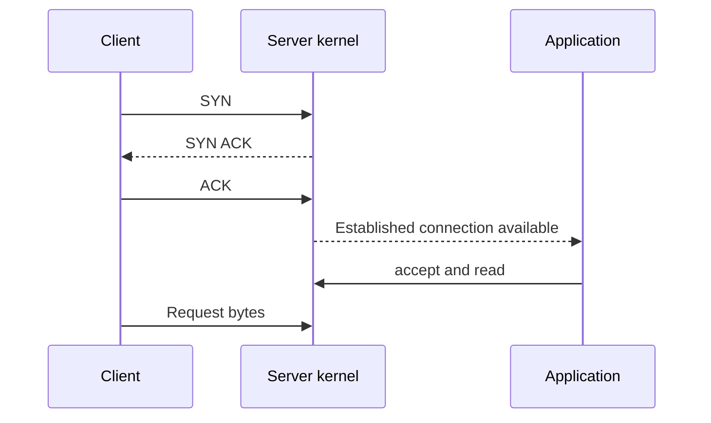
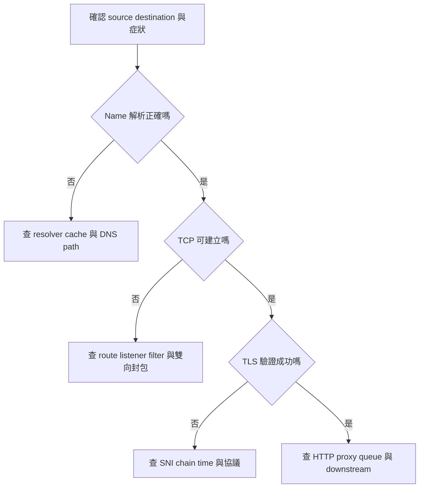

# Network 面試完整手冊

SRE · Production Engineering · Infrastructure Engineering  
為 ChengDe 編寫｜2026 年 9 月 15 日｜從封包原理到服務除錯

這本書要讓你能完整解釋一次 request 的旅程，並在 DNS、TCP、TLS、HTTP、load balancer 或 downstream 出問題時，用測試與封包證據定位。你不必背每個 header bit，但必須能說清楚「這項證據排除了什麼，還沒排除什麼」。

建議分 4–6 個約一小時時段讀完，再做 labs 與口試；時間依你停下來推理的程度而變。先讀第 1–13 章，再進 Kubernetes、datacenter 與案例。Linux 命令以常見環境為例；macOS 的工具與 flags 不一定相同。

**章節導航**

- [1 研究範圍與學習優先順序](#1-研究範圍與學習優先順序)
- [2 網路分層與一次 Request](#2-網路分層與一次-request)
- [3 IP Subnet Routing 與鄰居解析](#3-ip-subnet-routing-與鄰居解析)
- [4 DNS 的機制與除錯](#4-dns-的機制與除錯)
- [5 TCP Connection 與 Socket Lifecycle](#5-tcp-connection-與-socket-lifecycle)
- [6 TCP Flow Control Congestion 與 Throughput](#6-tcp-flow-control-congestion-與-throughput)
- [7 TLS Authentication 與加密](#7-tls-authentication-與加密)
- [8 HTTP Proxy 與 Connection Reuse](#8-http-proxy-與-connection-reuse)
- [9 NAT Firewall Load Balancer 與 Rate Limiting](#9-nat-firewall-load-balancer-與-rate-limiting)
- [10 MTU ICMP 與 Path Diagnosis](#10-mtu-icmp-與-path-diagnosis)
- [11 Latency 分解與 Timeout Budget](#11-latency-分解與-timeout-budget)
- [12 Tcpdump 從封包建立證據](#12-tcpdump-從封包建立證據)
- [13 一條有分支的除錯流程](#13-一條有分支的除錯流程)
- [14 Kubernetes Network Troubleshooting](#14-kubernetes-network-troubleshooting)
- [15 Datacenter 與 IPv6 進階面試範圍](#15-datacenter-與-ipv6-進階面試範圍)
- [16 六個完整情境題](#16-六個完整情境題)
- [17 三個小型實驗](#17-三個小型實驗)
- [18 口頭驗收](#18-口頭驗收)
- [19 面試前十分鐘回顧](#19-面試前十分鐘回顧)
- [20 來源與深讀路徑](#20-來源與深讀路徑)

## 1 研究範圍與學習優先順序

HM 已明確點名 Network。跨公司官方 SRE 職缺也要求 IP networking 與 performance troubleshooting；這支持以通用 infrastructure 能力準備。公開面試分享提供題型線索，不能確認你的輪次安排或逐題內容。[Google Core Networking SRE 職缺](https://www.google.com/about/careers/applications/jobs/results/111340067745604294-staff-site-reliability-engineer/)、[Meta 社群面試分享](https://www.reddit.com/r/leetcode/comments/1gqtm8s/targeting_meta_insights_from_meta_interview_loops/)

技術內容以 IETF RFC、Linux tools、curl 與 Kubernetes 官方文件核實。以下 P0/P1/P2 是本書建議準備順序，不是官方考頻。

| 優先 | 領域 | 學會後應能回答 |
|---|---|---|
| P0 | DNS、TCP、TLS、HTTP | 打開 URL 發生什麼；每個階段怎樣失敗 |
| P0 | host route、listener、packet capture | request 卡在哪裡；從哪一側測試 |
| P0 | latency、timeouts、pools、LB | 為何 ping 通但服務慢；為何加 pool 沒幫助 |
| P1 | subnet、ARP／NDP、NAT、MTU | 同 subnet／跨 subnet；大封包失敗 |
| P1 | retransmission、windows、HTTP2／QUIC | throughput、head-of-line blocking 與 backpressure |
| P1 | Kubernetes networking | Pod／Service／Ingress 的差異與故障邊界 |
| P2 | BGP、ECMP、leaf-spine、IPv6 | datacenter 基礎與部分路徑故障的推理 |

你的主線是：**來源與目的 → 實際路徑 → 哪個階段完成 → 哪個階段沒有完成 → 下一個可區分假設的測試。**

## 2 網路分層與一次 Request

### 2.1 常用四層模型

| 層 | 解決什麼 | 典型識別資訊 | 工具入口 |
|---|---|---|---|
| Link | 同一 link 上如何送 frame | MAC、VLAN | `ip link`、`ip neigh` |
| Internet | 跨網段如何送 packet | IP、prefix、next hop | `ip addr`、`ip route` |
| Transport | 端到端 transport | TCP／UDP ports、connection state | `ss`、`tcpdump` |
| Application | request／response 語意 | DNS name、HTTP path、RPC method | `dig`、`curl`、logs／traces |

OSI 七層可用來溝通，但不要花時間爭 TLS 一定屬於第幾層；面試更在意它何時執行、保護哪個 connection，以及在哪裡終止。

### 2.2 打開 HTTPS URL

假設沒有可重用 connection、沒有可用 DNS cache，採 HTTPS over TCP：client 解析 URL，透過 resolver 取得 IP；OS 查 route 並找到 next hop；建立 TCP；進行 TLS authentication／key establishment；傳 HTTP request；server／proxy 處理後回 response；client 讀完 body，connection 可保留供重用。

實務有很多捷徑與變體：DNS cache、connection reuse、TLS session resumption、proxy、HTTP/3 都會改變流程。不要說「每個 request 都要重新 DNS＋TCP＋TLS」。

**英文口試**

> Assuming a new HTTPS connection over TCP, the client resolves the hostname, selects a route, establishes TCP, and completes TLS before exchanging HTTP data. I would first check whether DNS and connections are being reused, because that changes both the request path and the latency breakdown.

### 2.3 封包經過 router 時什麼改變

一般 routed traffic 每一 hop 的 link-layer header 會改變，IP destination 通常仍是最後目的地；TTL／Hop Limit 遞減。若有 NAT，IP／port 也可能被改寫；若有 reverse proxy，可能是前後兩條不同 TCP connections。抓到一段流量不能自動代表另一段也正常。

## 3 IP Subnet Routing 與鄰居解析

### 3.1 CIDR 要能真的算

IPv4 是 32 bits；`/24` 表示前 24 bits 是 prefix，留下 8 bits，整個 block 有 256 個 addresses。傳統一般 subnet 的 host usable 常扣 network／broadcast，但 `/31` point-to-point 等有例外，不要一概說所有情況都減二。

**例子：`10.20.30.77/26`。** Block 大小是 64；77 落在 64–127，因此 network 是 `10.20.30.64`，broadcast 是 `.127`，一般 host range `.65–.126`。`10.20.30.140` 落在另一個 /26，需要依 route 送到相應 next hop。

Route 依 longest prefix match 選擇。若同時有 `10.0.0.0/8`、`10.20.0.0/16`、default route，目的 `10.20.30.77` 優先命中 /16；同 prefix 還可能受 metric／policy routing 影響。

```bash
ip -br addr
ip route
ip route get 10.20.30.77
ip rule
```

| 指令／參數 | 用途 |
|---|---|
| `ip -br addr` | `-br` 是 brief；`addr` 顯示 interface 的 addresses。先看 interface 是否 `UP`、拿到哪個 prefix。 |
| `ip route` | 顯示目前 network namespace 的 routes；沒有帶 table 時通常看 main table。留意 prefix、`via` next hop、`dev` interface、`src` source address 與 metric。 |
| `ip route get 10.20.30.77` | `get` 請 kernel 對單一 destination 做一次 route lookup；可再加 `from <source-ip>` 模擬不同 source。它不會真的送 packet。 |
| `ip rule` | 顯示 policy-routing rules 與 priority；數字越小通常越早評估。它說明 lookup 會查哪些 routing tables。 |

#### 示例輸出

以下 IP、interface 與 table 都是示例。

```text
$ ip -br addr
lo               UNKNOWN        127.0.0.1/8 ::1/128
eth0             UP             10.20.30.70/26 fe80::20c:29ff:feaa:1001/64

$ ip route
default via 10.20.30.65 dev eth0 proto dhcp src 10.20.30.70 metric 100
10.20.30.64/26 dev eth0 proto kernel scope link src 10.20.30.70

$ ip route get 10.20.30.77
10.20.30.77 dev eth0 src 10.20.30.70 uid 1000
    cache

$ ip rule
0:      from all lookup local
32766:  from all lookup main
32767:  from all lookup default
```

讀法：`10.20.30.77` 命中 on-link `/26`，所以沒有 `via` gateway，從 `eth0` 使用 `10.20.30.70` 當 source。這只證明 kernel 的選路結果；沒有證明 ARP 成功、封包送達或遠端 service 正常。

`ip route get` 可顯示 kernel 對該 destination 的 route lookup、source address 與 interface；它不會替你證明遠端 server 正常。不同 source、namespace、routing rules 可產生不同結果。

Route lookup 與命令語意參見 [ip-route(8)](https://man7.org/linux/man-pages/man8/ip-route.8.html)。

### 3.2 ARP 與 NDP

IPv4 在適用的 link 上透過 ARP 找 IP 對應的 MAC。目的在本 subnet 時尋找目的主機；跨 subnet 時通常解析 gateway 的 MAC，**不是對遠端跨網段 server 做 ARP**。[RFC 826](https://www.rfc-editor.org/rfc/rfc826.html)

```bash
ip neigh show
ip -s link
```

| 指令／參數 | 用途 |
|---|---|
| `ip neigh show` | 顯示本 network namespace 的 IPv4 ARP／IPv6 NDP neighbor entries。可加 `dev eth0` 只看某 interface。 |
| `ip -s link` | `-s` 顯示 RX／TX counters；`link` 顯示 interfaces。重複 `-s -s` 在部分版本可顯示更多統計。 |

#### 示例輸出

```text
$ ip neigh show dev eth0
10.20.30.65 lladdr 00:11:22:33:44:55 REACHABLE
10.20.30.88 lladdr 00:11:22:33:44:88 STALE
10.20.30.99 FAILED

$ ip -s link show dev eth0
2: eth0: <BROADCAST,MULTICAST,UP,LOWER_UP> mtu 1500 state UP
    RX: bytes  packets  errors  dropped  missed  mcast
       8420192    18240       0        3       0    112
    TX: bytes  packets  errors  dropped  carrier  collsns
       2301180    12003       0        0        0        0
```

讀法：`REACHABLE` 表示近期確認過 neighbor；`STALE` 不是立即故障，只是需要再次確認；`FAILED` 表示解析未成功。RX drops／errors 增長值得追查，但單一累積值不能告訴你問題何時發生，應間隔取樣並對照流量。

Neighbor INCOMPLETE／FAILED 指向 link／neighbor resolution 問題，可能是 VLAN、對端、interface 或配置；不應直接歸因 DNS。IPv6 使用 Neighbor Discovery，沒有 IPv4 那種 ARP broadcast；不要把 IPv6 當作只換長一點的地址。

### 3.3 常見地址

| 地址範圍 | 用途 |
|---|---|
| `127.0.0.0/8`、`::1` | loopback，最常見 `127.0.0.1` |
| `10.0.0.0/8` | IPv4 private |
| `172.16.0.0/12` | IPv4 private；不是整個 172/8 |
| `192.168.0.0/16` | IPv4 private |
| `169.254.0.0/16` | IPv4 link-local，雲端亦有特定 metadata 用途 |
| `0.0.0.0` 作 listener | 常表示 bind 所有本地 IPv4 interfaces，不是可供 client 使用的正常遠端地址 |

## 4 DNS 的機制與除錯

### 4.1 Resolver 不等於 authoritative server

Application 常呼叫 OS resolver；stub resolver 向 recursive resolver 查詢。若 cache miss，recursive resolver 可透過 root、TLD、authoritative referrals 找答案。Authoritative server 管理 zone 資料；recursive resolver 幫 client 找答案並 cache。[RFC 1034](https://www.rfc-editor.org/rfc/rfc1034.html)

| Record | 意義 | 追問 |
|---|---|---|
| A | IPv4 address | 多個 answers 不等於完整負載均衡保證 |
| AAAA | IPv6 address | IPv6 路徑壞了可能只有部分 clients 慢 |
| CNAME | 別名指向另一個 name | 不是 HTTP redirect |
| NS | zone 的 authoritative nameservers | delegation 是否正確 |
| MX | 郵件路由 | 不直接決定網站 IP |
| TXT | 文字資料，常用於驗證／policy | 不應把任意 TXT 當可信授權 |
| SOA | zone 相關管理資訊 | 與 negative caching 有關 |

### 4.2 TTL 與負快取

TTL 控制 cache 可保留資料的時間。改 authoritative record 不會瞬間清除各層已有 cache。NXDOMAIN 等否定答案也能被 cache，因此剛建立的 name 可能仍短時間查不到；negative caching 有專門規則。[RFC 2308](https://www.rfc-editor.org/rfc/rfc2308.html)

不要把所有 DNS 失敗叫「沒同步」：NXDOMAIN 是 name 不存在的答案，SERVFAIL 是 resolver 無法完成解析的一類失敗，timeout 則是沒有及時拿到答案。三者除錯方向不同。

### 4.3 UDP 與 TCP

DNS 常用 UDP 53，但也必須考慮 TCP，例如 truncated response 後重試、大型回覆及某些操作。只允許 UDP 53 可能導致部分查詢正常、部分失敗；DNS over TLS／HTTPS 是另一些 transport 方式。[RFC 7766](https://www.rfc-editor.org/rfc/rfc7766.html)

```bash
getent ahosts example.com
dig example.com A
dig example.com AAAA
dig @1.1.1.1 example.com A
dig +tcp example.com A
dig +trace example.com
cat /etc/resolv.conf
```

| 指令／參數 | 用途 |
|---|---|
| `getent ahosts example.com` | `getent` 查 NSS database；`ahosts` 以 socket address 形式列出結果，會受 `/etc/nsswitch.conf`、`/etc/hosts` 等影響。 |
| `dig example.com A`／`AAAA` | 第一個參數是 name，第二個是 record type；不指定 server 時使用系統設定的 resolver。 |
| `dig @1.1.1.1 example.com A` | `@server` 指定要詢問的 DNS server；不代表 application 平常也用它。 |
| `dig +tcp example.com A` | `+tcp` 強制 DNS over TCP，適合比較 UDP 正常但 TCP 53 被擋等差異。 |
| `dig +trace example.com` | `+trace` 從 root referrals 逐層追到 authoritative answer；不是透過平常 recursive resolver 完成。 |
| `cat /etc/resolv.conf` | 查看 `nameserver`、`search`、`options` 等 resolver 設定；在 systemd-resolved、container 或 pod 中可能只是 stub／產生檔。 |

#### 示例輸出

```text
$ dig example.com A
;; ->>HEADER<<- opcode: QUERY, status: NOERROR, id: 24101
;; flags: qr rd ra; QUERY: 1, ANSWER: 1, AUTHORITY: 0, ADDITIONAL: 1

;; QUESTION SECTION:
;example.com.             IN      A

;; ANSWER SECTION:
example.com.      300     IN      A       93.184.216.34

;; Query time: 18 msec
;; SERVER: 10.96.0.10#53(10.96.0.10) (UDP)

$ getent ahosts example.com
93.184.216.34  STREAM example.com
93.184.216.34  DGRAM
93.184.216.34  RAW
```

讀法：`status: NOERROR` 加上 ANSWER 才表示這次查到 A record；`300` 是這筆 answer 的 TTL；`SERVER` 告訴你實際詢問哪個 resolver 與 transport。若是 `NOERROR` 但 `ANSWER: 0`，不要說成 NXDOMAIN；若是 `SERVFAIL`，則是 resolver 無法完成解析。

`getent` 走系統 name-service 配置，較接近部分 applications 的 lookup；`dig` 直接做 DNS 查詢，不完全重現 application 的 NSS、hosts file 或內建 cache 行為。指定公共 resolver 只適用能從該 resolver 解析的 public name；internal／split-horizon DNS 不該以公共查詢結果下結論。

**情境：你筆電查得到，pod 查不到。** 從該 pod 查 resolver、search domains、DNS policy、到 DNS server 的 TCP／UDP 路徑，並對照同 node／其他 node 的 pods。筆電成功只排除部分 public authoritative 問題。

**追問：TTL 調低有什麼成本？** Failover／更新可較快反映，但 cache hit 降低，query load 與 resolver dependency 增加；已建立 connections 仍不會因 DNS TTL 到期而強制搬家。

## 5 TCP Connection 與 Socket Lifecycle

### 5.1 TCP 提供什麼

TCP 提供可靠、有序的 byte stream，有 sequence numbers、acknowledgments、retransmission、flow control 等機制。它沒有 application message boundaries；也不承諾 server 已把業務操作 durable commit。

一般 connection 由 protocol、source IP／port、destination IP／port 識別。Server 可在同一 listening port 服務大量 clients，因為 accepted connections 有不同 tuples。不是每個 client 都需要一個新的 server listening port。

### 5.2 三向交握

Client 發 SYN，server 回 SYN-ACK，client 回 ACK，雙方建立初始 sequence space 與連線狀態。兩個方向都有各自 sequence numbers。三向 handshake 不是 TLS authentication。[RFC 9293 TCP](https://www.rfc-editor.org/rfc/rfc9293.html)



Application 的 `accept`／讀取與 request arrival 可交錯；diagram 用來呈現 kernel 建立 connection 與 application 處理是不同階段，不是所有事件的唯一排程。

### 5.3 Listener 半連線與 accept queue

Listening socket 用來接受新 connections；accepted socket 處理某個 connection。Linux 有與 incomplete handshake 和 completed-but-not-accepted connections 相關的 queues／limits。看到 TCP handshake 成功，不代表 application 已 accept 或處理。

```bash
ss -lntp
ss -ntp
ss -s
ss -tin
```

| 參數 | 意義 |
|---|---|
| `-l` | 只看 listening sockets。 |
| `-n` | 不解析 hostname 與 service name，直接顯示 numeric IP／port。 |
| `-t` | 只看 TCP；可用 `-u` 看 UDP。 |
| `-p` | 顯示擁有 socket 的 process；可能需要足夠權限。 |
| `-s` | 顯示 socket summary，不是逐條 connection。 |
| `-i` | 顯示 internal TCP information，例如 RTT、cwnd、retransmission。 |

#### 示例輸出

欄位會依 iproute2 版本與 terminal 寬度略有不同。

```text
$ ss -lntp
State  Recv-Q Send-Q Local Address:Port Peer Address:Port Process
LISTEN 0      4096         0.0.0.0:443       0.0.0.0:*   users:(("nginx",pid=812,fd=7))

$ ss -ntp
State Recv-Q Send-Q Local Address:Port   Peer Address:Port Process
ESTAB 0      120    10.0.1.10:443       10.0.2.25:51842   users:(("nginx",pid=812,fd=12))

$ ss -tin dst 10.0.2.25
ESTAB 0 120 10.0.1.10:443 10.0.2.25:51842
 cubic rto:204 rtt:3.2/0.8 cwnd:10 bytes_acked:18421 bytes_retrans:0
```

讀法：第一段證明 nginx 在所有本地 IPv4 interfaces 的 443 listen。第二段 `Send-Q 120` 表示仍有資料等待傳送／確認，但一次 snapshot 不足以判定卡住；應重複觀察。`rtt`、`cwnd` 與 retransmission 是該 TCP connection 的線索，不是整個 service 的統計。

`-l` listening、`-n` numeric、`-t` TCP、`-p` process、`-i` internal TCP info。對 ESTABLISHED sockets，Recv-Q 可反映尚未被 application 讀走的資料，Send-Q 反映仍待傳送／確認的資料；LISTEN sockets 的 queue 欄位有不同意義，常用來看 pending connections 與 backlog。[ss(8)](https://man7.org/linux/man-pages/man8/ss.8.html)

**Listener 存在但服務仍 timeout：**可能 backlog 壓力、application 沒讀、event loop 卡住、TLS 失敗、downstream 等待。`ss -lntp` 只回答「有人在 listen」，不代表 request path 全通。

### 5.4 Close FIN RST TIME_WAIT

FIN 表示該方向不再送資料；TCP 支援 half-close，所以常用四步說明雙向關閉，但 ACK 與 FIN 可以合併，不能說每次一定四個 packets。RST 是 abrupt reset，可能來自 endpoint 或中間設備。

TIME_WAIT 常在 active closer，協助處理 delayed segments 與最後 ACK 的重傳情況；它不等於 application FD leak。CLOSE_WAIT 表示收到了 peer 的 FIN，本地 application 尚未完成 close；若持續大量堆積，要查 socket lifecycle。

**追問：TIME_WAIT 很多要不要全部清掉？** 先查 connection churn、目的 tuples、port pressure、pool reuse。它常是正常保護機制；亂改 reuse／timeout 參數可能掩蓋 churn 問題並改變 correctness 邊界。

## 6 TCP Flow Control Congestion 與 Throughput

### 6.1 Flow control 和 congestion control

Flow control 保護 receiver 不被 sender 淹沒，與 receiver advertised window 有關；congestion control 控制對 network path 的壓力，與 congestion window 有關。Sender 的 outstanding data 同時受這些限制，還會受 application 供給與 buffers 影響。

經典 TCP congestion control 包含 slow start、congestion avoidance、fast retransmit／recovery；不同演算法如 CUBIC、BBR 有不同策略。面試先講清楚 network capacity 與 receiver capacity 是兩回事，不必假定所有 connections 都用同一演算法。[RFC 5681](https://www.rfc-editor.org/rfc/rfc5681.html)

### 6.2 RTT bandwidth 與 BDP

RTT 是 Round-Trip Time；bandwidth 是 link 的傳輸能力；throughput 是實際完成的速率；goodput 常指扣除 protocol／retransmission overhead 後的有效資料速率。

Bandwidth-delay product 是要填滿 path 所需的在途資料量。自編例子：1 Gbit/s、RTT 100 ms，BDP 約為 100 Mbit，即 12.5 MB。若在途資料只有 1 MB，理想化上限約 10 MB/s，遠低於 125 MB/s 的 link bandwidth，尚未算 loss 等影響。

**重要：低 latency 不等於高 throughput，高 bandwidth 也不消除 RTT。** Request 必須串行經過 5 次跨洲往返，僅加大 bandwidth 通常不能消除那 5 次往返。

### 6.3 Retransmission 能說什麼

Retransmission 支持有 loss、過度延遲或其他讓 sender 判定需要重送的情況，但不直接說明是某一台 firewall 的錯。要看發生比例、時點、方向、host／NIC counters、path 差異與 receiver 行為。

Zero window 表示 receiver 當時無法接收更多資料，可能 application 沒讀、buffer 壓力；這和 network congestion 不一樣。Repeated duplicate ACKs 可提示 gap／out-of-order，但要看完整序列與 capture 限制。

## 7 TLS Authentication 與加密

TLS 解決 transport connection 的機密性、完整性與 peer authentication。一般 HTTPS client 會驗證 server certificate chain、hostname、有效期等，再建立對稱 session keys。不是「拿 certificate 的 public key 加密整段 HTTP body」。

TLS 1.3 一般新 handshake 可在一個 TLS round trip 完成相應建立流程，之前仍可能需要 TCP handshake。Resumption 的 0-RTT 有 replay 風險，不是任意非冪等操作都能安全使用。[RFC 8446](https://www.rfc-editor.org/rfc/rfc8446.html)

| 名詞 | 用途 | 典型失敗 |
|---|---|---|
| CA chain | 建立 certificate 的信任鏈 | missing intermediate、unknown root |
| SAN／hostname | 確認 certificate 是否對應目標 name | 打 IP 卻收到只涵蓋 hostname 的憑證 |
| SNI | client 指出要連哪個 hostname，協助多站台選 certificate | 忘帶 name，命中預設站台 |
| ALPN | 協商 application protocol，例如 h2 | client／server 支援不合 |
| mTLS | 雙方驗證 certificate | client certificate 過期或未受信任 |

```bash
openssl s_client -connect example.com:443 -servername example.com -verify_hostname example.com -verify_return_error </dev/null
curl -v --connect-timeout 3 --max-time 10 https://example.com/
```

| 指令／參數 | 用途 |
|---|---|
| `openssl s_client` | 建立 TLS client connection 並印出 handshake／certificate 資訊。 |
| `-connect example.com:443` | 指定 TCP destination。 |
| `-servername example.com` | 傳送 SNI，讓多站台 server 選對 certificate。 |
| `-verify_hostname example.com` | 驗證 certificate 是否涵蓋此 hostname。 |
| `-verify_return_error` | 驗證失敗時讓 command 以錯誤結束，而不是只把問題印出來。 |
| `</dev/null` | 關閉互動輸入，完成 handshake 後不等待你繼續輸入 application data。 |
| `curl -v` | 顯示 DNS／connect／TLS／request／response headers 等 verbose 訊息；主要寫到 stderr。 |
| `--connect-timeout 3` | Connection phase 最多等待 3 秒，包含 name lookup 與建立所需的 protocol handshakes。 |
| `--max-time 10` | 整個 operation 最多 10 秒；不是每個階段各 10 秒。 |

#### 示例輸出節錄

```text
$ openssl s_client ...
subject=CN = example.com
issuer=C = US, O = Example CA, CN = Example Intermediate
Verification: OK
Verify return code: 0 (ok)

$ curl -v --connect-timeout 3 --max-time 10 https://example.com/
* Connected to example.com (93.184.216.34) port 443
* SSL connection using TLSv1.3 / TLS_AES_256_GCM_SHA384
*  subjectAltName: host "example.com" matched cert's "example.com"
> GET / HTTP/1.1
> Host: example.com
< HTTP/1.1 200 OK
< content-type: text/html
```

讀法：`Verify return code: 0` 或 curl 的 hostname match 只表示這次 client 使用的 trust settings 驗證成功；不代表 backend、另一台 client 或 LB 後方的 TLS 也相同。HTTP status 出現表示 TLS 已完成，但 `200` 仍不證明所有 downstream 都健康。

OpenSSL 的 trust store、版本與 server chain 會影響驗證；要讀 verification result，不能只看印出了 certificate。TLS termination 在 LB 時，client-to-LB 與 LB-to-backend 是兩段獨立安全關係；backend 可是 HTTP 或另一條 TLS。

**典型追問：curl -k 成功，問題解決了嗎？** 沒有；它支持 certificate validation 相關假設，但跳過驗證不能作為正式修復。要修 trust chain、hostname、有效期或時鐘。

## 8 HTTP Proxy 與 Connection Reuse

### 8.1 狀態碼是線索 不是完整 root cause

| 狀態 | 一般語意 | 還要問什麼 |
|---|---|---|
| 400 | request 有問題 | 哪個 parser／validator 回的 |
| 401 | 缺少有效 authentication | token、expiry、audience |
| 403 | 拒絕存取 | authorization、policy、WAF |
| 404 | target resource 未找到 | routing、region data、cache、權限遮蔽 |
| 429 | rate limit | 限制維度、Retry-After、合法用量 |
| 500 | server internal error | 哪一層的 exception |
| 502 | gateway／proxy 從 upstream 拿到無效 response | connect reset、protocol、upstream logs |
| 503 | 暫時無法服務 | overload、無健康 upstream、維護 |
| 504 | gateway 等 upstream 超時 | upstream 慢、path、timeout budget |

HTTP 的 method、status、cache 等有明確語意；實際 product 也可能不完全遵守。先辨識產生 response 的元件，不要只靠數字斷言。[RFC 9110](https://www.rfc-editor.org/rfc/rfc9110.html)

### 8.2 HTTP keep-alive 與 TCP keepalive

HTTP connection reuse 減少每次 TCP／TLS 建立成本。TCP keepalive 是在 idle 時用 probes 偵測某些失聯情況，並非 HTTP request timeout，也不是固定頻率 application heartbeat。

Pool 太小會讓 request 等待可用 connection；太大會用掉 FD、memory、ephemeral ports 或讓 DB／upstream 過載。必須觀察 acquire wait、active／idle、hold time、creation rate、reuse 與 upstream capacity。

### 8.3 HTTP1 HTTP2 HTTP3

HTTP/1.1 通常透過多條可重用 connections 增加並行；HTTP/2 在同一 connection 上 multiplex 多個 streams，但底層 TCP 的 byte ordering 仍可能讓 packet loss 阻擋多個 streams 的交付。HTTP/2 也有 stream 與 connection flow control。[RFC 9113](https://www.rfc-editor.org/rfc/rfc9113.html)

HTTP/3 建立在 QUIC；QUIC 以 UDP 為 substrate，自己提供可靠 streams、congestion control 等。不同 streams 不需要共享同一條 TCP byte stream 的交付順序，因此減輕其跨 stream HOL；仍有 shared congestion／connection-level resources，不是完全互不影響。[RFC 9000](https://www.rfc-editor.org/rfc/rfc9000.html)

**追問：UDP 不可靠，所以 QUIC 不可靠嗎？** UDP 本身不提供可靠傳輸；上層 protocol 可以自己實作。不要把底層的「沒有提供」理解成上層「不可能提供」。

## 9 NAT Firewall Load Balancer 與 Rate Limiting

NAT 改寫 address，PAT 也改寫 port，讓多個內部 connections 共用外部 IP。SNAT 常用於 egress，DNAT 常用於將目的導向 backend。實際設備還可能維持 connection tracking state；port 或 conntrack table 耗盡會造成新 connections 失敗。

Stateful firewall 能根據 connection state 允許 return traffic；stateless ACL 需要明確考慮雙向規則與 ephemeral ports。具體雲端產品語意要查相應文件，不能把一個平台的 security group 行為套到所有設備。

| 元件 | 主要決策資訊 | 不能混同 |
|---|---|---|
| L4 LB | IP、port、transport connection | 不一定理解 URL 或業務 user |
| L7 reverse proxy／LB | HTTP host、path、headers 等 | 加上 TLS termination／HTTP processing 成本 |
| API gateway | auth、routing、quota、API policy 等 | 是功能集合，常同時含 proxy／LB 能力 |
| Forward proxy | 代表 client 對外 | 與 server 前面的 reverse proxy 方向不同 |

**你之前問的 hot key rate limit：可以，但要先定義 key 在哪裡。** 若 L7 proxy 可可靠取得 URL、header 中的 product ID 或 authenticated user，就可依這些值限流；若「hot key」只存在 server 內部 DB query，或是必須解密／解析 payload 才知道，gateway 不會自動知道。還要處理 key spoofing、高基數 state、分散式 quota 與 legitimate hot traffic。

Health check 通過不等於所有功能健康。只 probe `/healthz` 可能沒測到 DB write 或某個 shard；把所有 dependencies 放進 liveness 又可能造成 restart storm。區分「能否繼續活著」「是否接新流量」「業務結果是否正確」。

## 10 MTU ICMP 與 Path Diagnosis

### 10.1 MTU MSS 與大封包問題

MTU 是某 link 可承載的最大 IP packet 規模；TCP MSS 是 TCP segment 的 payload 上限，需扣 IP／TCP headers 等。Tunnel／overlay 會增加 outer headers，降低可用內層 MTU。

Path MTU discovery 用機制找到沿路可用大小；IPv4 的 DF 與 ICMP fragmentation-needed 是經典方式。若必要的 ICMP 被濾掉，可能出現 small requests 成功、大 payload 卡住的 black hole。[RFC 1191](https://www.rfc-editor.org/rfc/rfc1191.html)

IPv6 routers 不做沿途 fragmentation，來源依相應資訊調整，ICMPv6 Packet Too Big 因此重要。IPv6 還涉及 NDP、RA 等控制流量，不能把所有 ICMP 一概擋掉。[RFC 8200](https://www.rfc-editor.org/rfc/rfc8200.html)

### 10.2 Ping traceroute mtr

```bash
ping -c 4 192.0.2.10
traceroute 192.0.2.10
mtr -rw -c 10 192.0.2.10
tracepath 192.0.2.10
```

`192.0.2.10` 是文件示例地址，請換成你的授權練習 endpoint；以上不是保證可到達的真實服務。

| 指令／參數 | 用途 |
|---|---|
| `ping -c 4 <ip>` | `-c 4` 發四次 probe 後停止。看 packet loss 與 RTT，但只測 ICMP echo path。 |
| `traceroute <ip>` | 逐步增加 TTL，從沿途回覆推估 hops。Linux 預設 probe 類型可能與其他 OS 不同；需要貼近 HTTPS 時可用支援的 TCP mode。 |
| `mtr -rw -c 10 <ip>` | `-r` 產生一次 report、`-w` 使用較寬欄位、`-c 10` 每個 hop 測十個 cycles。 |
| `tracepath <ip>` | 顯示推估路徑，也會嘗試找 path MTU；Linux 上通常不需要 root。 |

#### 示例輸出

數字只用來示範欄位。

```text
$ ping -c 4 192.0.2.10
64 bytes from 192.0.2.10: icmp_seq=1 ttl=57 time=12.4 ms
64 bytes from 192.0.2.10: icmp_seq=2 ttl=57 time=12.8 ms
--- 192.0.2.10 ping statistics ---
4 packets transmitted, 4 received, 0% packet loss
rtt min/avg/max/mdev = 12.1/12.5/12.8/0.3 ms

$ mtr -rw -c 10 192.0.2.10
HOST              Loss%  Snt  Last  Avg  Best  Wrst StDev
gateway.local       0.0%   10   0.6  0.7   0.5   1.1   0.2
198.51.100.1       60.0%   10   5.1  5.0   4.8   5.2   0.1
192.0.2.10          0.0%   10  12.6 12.5  12.1  12.9   0.3

$ tracepath 192.0.2.10
 1?: [LOCALHOST]                      pmtu 1500
 1:  gateway.local                     0.722ms
 2:  198.51.100.1                      5.021ms
 3:  192.0.2.10                       12.571ms reached
     Resume: pmtu 1500 hops 3 back 3
```

讀法：上面的 MTR 中間 hop 顯示 60% loss，但目的地沒有 loss；較合理的第一個假設是該 router 限制對 probe 的回覆，不是它丟掉了 60% 的轉送流量。`tracepath` 的 `pmtu 1500` 是這次探測得到的 path MTU 線索，不表示所有路徑永遠都是 1500。

Ping 通只證明某種 ICMP exchange 成功，不保證 TCP 443 或 application 正常。Ping 不通也可能只是 ICMP policy。Traceroute 利用逐步增加 TTL／Hop Limit 與沿途回覆推估路徑；probe 可用 UDP、ICMP、TCP，工具與選项不同。

中間一跳 `* * *`，後面又有回覆，表示至少那些後續 probes 能往前走；該 router 可能限速／不回 control-plane messages。Mtr 中間 hop loss 高、後續 loss 不延續，不足以證明 forwarding 丟包。回程路徑也可能不相同，不能把某 hop 的 RTT 當該段 link 的單向 latency。

## 11 Latency 分解與 Timeout Budget

把「慢」分成 DNS、connect、TLS、request queue、application processing、downstream、response transfer。你熟悉的 DB pool wait 屬於 application／dependency 使用方式，可能表現成 HTTP request latency，但不是自動等於網路故障。

```bash
curl -sS -o /dev/null --connect-timeout 3 --max-time 10 \
  -w 'dns=%{time_namelookup}\nconnect=%{time_connect}\ntls=%{time_appconnect}\nttfb=%{time_starttransfer}\ntotal=%{time_total}\n' \
  https://example.com/
```

| 參數 | 用途 |
|---|---|
| `-sS` | `-s` 關閉 progress meter；搭配 `-S` 仍顯示 errors。 |
| `-o /dev/null` | 不把 response body 印到 terminal；headers 與 timing 仍可另外輸出。 |
| `--connect-timeout 3` | Connection phase 最多三秒，包含 name lookup 與建立所需的 protocol handshakes；不是整個 request deadline。 |
| `--max-time 10` | 整個 curl operation 最多十秒。 |
| `-w '<format>'` | 完成後依 format 印出 curl 收集的 timing variables。 |

#### 示例輸出

```text
dns=0.010214
connect=0.030841
tls=0.081773
ttfb=2.083412
total=2.101904
```

讀法：這些多是從 request 起點累計，不應直接把每個數字當成獨立區段。本例可粗略算出 TCP 約 `0.0308 - 0.0102` 秒、TLS 約 `0.0818 - 0.0308` 秒，而 TLS 完成到第一個 response byte 約兩秒，因此下一步應查 server queue、handler 與 dependencies。

這些時間多是從起點累計；在簡單、無 proxy／redirect／reuse 的例子中，可用差值粗略分段。TTFB 包含先前階段與 server 等待，**不是純 application CPU time**。若 connection reuse、redirect、proxy 等存在，需重新解释。[curl manual](https://curl.se/docs/manpage.html)

**自編讀數：**DNS 0.01 s、connect 0.03 s、TLS 0.08 s、TTFB 2.08 s、total 2.10 s。主要延遲在完成 TLS 到收到第一個 response byte 的區間。接著查 server queue、handler、dependencies 與 trace；仍不能直接宣判 DB 慢。

Timeout 是等待的政策，不是對方失敗的證明。Connect timeout 與整體 request deadline 不同。上游給 1 秒，下游三次各 1 秒的 retry 就不合理；應傳遞 remaining budget，並計入 pool wait、connect、TLS、processing。

## 12 Tcpdump 從封包建立證據

```bash
sudo tcpdump -i any -nn -c 100 'tcp port 443 and host 192.0.2.10'
sudo tcpdump -i any -nn -c 100 'udp port 53 or tcp port 53'
```

| 指令／參數 | 用途 |
|---|---|
| `sudo` | Packet capture 通常需要額外權限；只在你有授權的系統與流量上使用。 |
| `-i any` | 在 Linux 的多個 interfaces 上 capture；若已知 interface，改用 `-i eth0` 可降低雜訊。 |
| `-nn` | 不反查 hostnames，也不把 port 轉成 service names，避免額外 DNS 與誤讀。 |
| `-c 100` | 收到 100 個符合條件的 packets 後停止。沒有匹配流量時仍可能一直等待。 |
| `'tcp port 443 and host 192.0.2.10'` | BPF filter：只保留與該 host 有關、source 或 destination port 為 443 的 TCP packets。 |

#### 示例輸出

```text
10:14:01.100001 IP 10.0.1.25.51842 > 192.0.2.10.443: Flags [S], seq 1000, win 64240, length 0
10:14:01.112401 IP 192.0.2.10.443 > 10.0.1.25.51842: Flags [S.], seq 8000, ack 1001, win 65160, length 0
10:14:01.112490 IP 10.0.1.25.51842 > 192.0.2.10.443: Flags [.], ack 8001, win 502, length 0

10:14:04.200110 IP 10.0.1.25.53001 > 10.96.0.10.53: 24101+ A? example.com. (29)
10:14:04.218301 IP 10.96.0.10.53 > 10.0.1.25.53001: 24101 1/0/0 A 93.184.216.34 (45)
```

讀法：`[S]`、`[S.]`、`[.]` 分別對應 SYN、SYN-ACK、ACK，支持 TCP handshake 在這個 capture point 上完成。DNS 例子的 query ID `24101` 與回覆相同，回覆含一筆 A answer。這仍不能證明 application handler 成功；也不能用單邊 capture 保證另一端實際看到了相同 packets。

Ctrl-C 可提早停止。從正確 host／namespace／interface 抓包，比背十個 flags 更重要。[tcpdump(8)](https://man7.org/linux/man-pages/man8/tcpdump.8.html)

| 觀察 | 可支持的判斷 | 不可跳到的結論 | 下一步 |
|---|---|---|---|
| Client 根本沒發 SYN | 尚未到 TCP 發起，或 capture 不對 | server firewall 有問題 | 查 DNS、pool、route、capture point |
| Client 發 SYN，server capture 沒看到 | 中途路徑／policy／NAT 或 capture 範圍問題 | 一定是某個 SG | 沿路兩側比對 counters／capture |
| Server 收到 SYN，未見 SYN-ACK | local stack／filter、backlog、回程或 capture 問題 | 一定 application bug | listener、local firewall、route、kernel counters |
| Server 發 SYN-ACK，client 沒看到 | return path、NAT、filter 或 capture 問題 | server 沒回 | 查回程路徑 |
| 立即 RST | 某一端／設備明確 reset | 一定是 server application | 找 RST 來源與 listener／policy |
| TCP 成功，TLS alert | security negotiation／validation 方向 | TCP 不通 | alert、chain、SNI、protocol |
| TCP 成功但無 response | application／TLS／dependency／queue 仍待查 | network 完全無問題 | 雙側 timing、application trace |
| Recv-Q 持續高 | application 消費資料不及 | network bandwidth 不足 | thread／event loop／CPU／backpressure |

HTTPS 抓包一般看不到 plaintext request／response。**看到 TLS application-data records，不等於證明 HTTP handler 收到某個完整 request。** 加密層與 application logs／tracing 必須配合。

Packet capture 也有侷限：offloading 可改變看到的 segmentation／checksum，capture 自身可能丟包，`any`／virtual interfaces 可能看到多次。若覺得證據矛盾，先確認觀測方式，別急著發明罕見網路故障。

## 13 一條有分支的除錯流程



這是一般 HTTPS 新連線的 diagnostic tree，不適用所有 protocols；已知 DNS 正常時不必每次從頭跑一遍。要依現有證據跳到資訊最有價值的測試。

**繞過 DNS 的正確方式：**HTTPS 測特定 IP 時可用 `curl --resolve example.com:443:IP https://example.com/`，保留 URL hostname／SNI。直接 `https://IP/` 改變了 hostname validation 與 virtual hosting，無法只隔離 DNS。`IP` 請換成你要測的實際 backend／edge IP。

## 14 Kubernetes Network Troubleshooting

### 14.1 先分清抽象

Pod 有自己的 network identity；Service 提供穩定發現／存取抽象，通常透過 selector 對應一組 endpoints；ClusterIP 是 virtual service address，不必有獨立 process 綁在它上面。實際 data path 依 kube-proxy mode 或替代 dataplane 而異。[Kubernetes Service](https://kubernetes.io/docs/concepts/services-networking/service/)

Ingress／Gateway 通常管理外部 HTTP routing；CNI 處理 pod networking；NetworkPolicy 是否生效取決於實作支援。DNS 正確、Service object 存在、Pod Running 都不能單獨保證可達。

```bash
kubectl get pods -o wide
kubectl get svc my-service -o yaml
kubectl get endpointslices -l kubernetes.io/service-name=my-service
kubectl describe pod my-pod
kubectl get networkpolicy
```

| 指令／參數 | 用途 |
|---|---|
| `kubectl get pods -o wide` | `-o wide` 多顯示 Pod IP、node 等欄位；`Running` 與 `Ready` 要分開看。 |
| `kubectl get svc my-service -o yaml` | 查看 Service selector、`port`、`targetPort` 與 type。YAML 比預設表格保留更多設定。 |
| `kubectl get endpointslices -l kubernetes.io/service-name=my-service` | `-l` 用 label selector 找該 Service 的 EndpointSlices；檢查 addresses 與 ready conditions。 |
| `kubectl describe pod my-pod` | 顯示 Pod 詳細狀態與近期 Events，適合看 readiness failures、scheduling 與 image／container 問題。 |
| `kubectl get networkpolicy` | 列出 namespace 內的 NetworkPolicies；object 存在不代表所用 CNI 一定有執行它。 |
| `-n <namespace>` | 以上指令可加入 namespace；沒寫時使用目前 context 的預設 namespace。 |

#### 示例輸出

```text
$ kubectl get pods -o wide
NAME                    READY   STATUS    RESTARTS   IP            NODE
api-6d9f8b7d8c-k4p2m    1/1     Running   0          10.244.2.17   worker-2

$ kubectl get svc my-service -o yaml
spec:
  selector:
    app: api
  ports:
  - port: 80
    targetPort: 8080

$ kubectl get endpointslices -l kubernetes.io/service-name=my-service
NAME               ADDRESSTYPE   PORTS   ENDPOINTS      AGE
my-service-x7k9m   IPv4          8080    10.244.2.17    4d
```

讀法：Service 80 會導向 selected endpoints 的 8080；EndpointSlice 至少列出一個 address。若 Service selector 寫錯，可能得到空 endpoints。Pod 顯示 `Running` 仍要看 `READY`、readiness probe 與實際 listener，不能直接宣告服務健康。

名稱與 namespace 請換成實際環境。用故障 client 所在的 network context 比較：DNS name、Service IP、individual endpoint。讀 Service selector、port／targetPort、EndpointSlice addresses／conditions；只因 object 存在就停止排查是不夠的。[Debug Services](https://kubernetes.io/docs/tasks/debug/debug-application/debug-service/)

### 14.2 對照結果定位

| 對照 | 候選原因 |
|---|---|
| Pod IP 成功，Service IP 失敗 | Service configuration、endpoint mapping、dataplane |
| Service IP 成功，name 失敗 | DNS／search domains／resolver path |
| 同 node 成功，跨 node 失敗 | cross-node routing、overlay、MTU、node firewall |
| Host 成功，pod 失敗 | namespace route／DNS、CNI、NetworkPolicy |
| 少數 endpoints 失敗 | specific pod／node／版本、listener、readiness |
| 小 request 成功，大 request 卡住 | MTU／path、body limits、application handling |

這些都是縮小範圍的假設，仍要用後續證據確認。

### 14.3 Cordon Drain 與流量

`cordon` 標記 node 不接一般新排程，不會自動停止既有 pod 的流量或把它們重建到別處。`drain` 是嘗試驅逐適用 pods 的 maintenance 動作，受 PDB 等條件影響；不是「把某個 pod 的流量暫停」。Readiness、endpoint 更新、LB connection draining 與 application shutdown 才是流量退出的相關機制。

Maintenance 的適用限制參見 [Kubernetes safely drain a node](https://kubernetes.io/docs/tasks/administer-cluster/safely-drain-node/)。

你可以先讓 instance 不再接新流量，再保留它除錯；但要確認已有 connections／requests 會如何完成。既有 TCP connection 不一定會立刻因 endpoint 更新而斷掉。

## 15 Datacenter 與 IPv6 進階面試範圍

### 15.1 BGP ECMP 與 leaf-spine

BGP 是依 route advertisements 與 policy 選路的 protocol；不同於「挑最低 ping 的路」。要理解 prefix、peer、withdrawal、convergence 與錯誤 route 的 blast radius，不必先背完整 configuration grammar。[RFC 4271](https://www.rfc-editor.org/rfc/rfc4271.html)

Leaf-spine fabric 讓 racks 經 leaf 與 spine 互連；ECMP 可把不同 flows 分散到等成本 paths，常依 hash。若某 path 故障，可能只有部分 5-tuples／clients 失敗；一次 curl 成功不足以排除 partial failure。逐 packet load balancing 可能導致 reordering，與 per-flow 分配的取捨不同。

Anycast 是多個位置宣告相同 IP prefix，routing 決定送到哪個位置，不等於 round-robin DNS，也不保證最近地理距離。Unicast 是一般指定單個目的；multicast 是群組分送的另一種機制。

### 15.2 IPv6 最低應知

128-bit address、prefix、link-local、NDP、ICMPv6、router advertisement；IPv6 不依賴 IPv4 NAT 才能運作。Dual stack 要分開測 IPv4／IPv6；AAAA 可解析卻不可達時，client address selection／fallback 會影響 latency。

```bash
curl -4 --max-time 10 https://example.com/
curl -6 --max-time 10 https://example.com/
ip -6 route
```

| 指令／參數 | 用途 |
|---|---|
| `curl -4` | 只使用 IPv4 做 name resolution／connection。 |
| `curl -6` | 只使用 IPv6；適合確認 dual-stack 問題是否只發生在其中一個 family。 |
| `--max-time 10` | 限制整個 curl operation 十秒，避免壞路徑長時間等待。 |
| `ip -6 route` | 只顯示 IPv6 routes；留意 connected prefix、default route、`via` 與 interface。 |

#### 示例輸出

```text
$ ip -6 route
2001:db8:10:20::/64 dev eth0 proto kernel metric 256
fe80::/64 dev eth0 proto kernel metric 256
default via fe80::1 dev eth0 metric 1024

$ curl -6 -v --max-time 10 https://example.com/
*   Trying [2001:db8::10]:443...
* connect to 2001:db8::10 port 443 failed: Network is unreachable
curl: (7) Failed to connect to example.com port 443
```

讀法：route table 例子有 global prefix、link-local 與 default route。curl 例子已取得 IPv6 address，但 connect 時回 `Network is unreachable`，方向偏向本機／namespace IPv6 route 或 connectivity，而不是 HTTP。若訊息是 `Could not resolve host`，才先回到 name resolution。

失敗也可能只是練習環境沒有 IPv6 connectivity。IPv6 與 BGP 列 P2：能解釋主要機制與 failure symptoms 即可；若 recruiter 後續說是 network-specialist round，再加深。

### 15.3 DHCP 與時間服務

DHCP 可提供 address 與 network configuration，與 DNS name resolution 是不同工作。NTP 等 clock synchronization 影響 certificate validation、token expiry、log correlation；wall clock 不準的症狀可能看似 auth／TLS／distributed ordering 問題。Duration／timeout 優先用合適的 monotonic clock，而不是假定 wall clock 永遠向前。

## 16 六個完整情境題

### A Ping 通 HTTPS timeout

先問 timeout 在 DNS、connect、TLS 還是 response。用 curl verbose／timing，檢查 listener 與雙向 TCP capture。若 TCP 成功 TLS 卡住，查握手與 server resource；若 TLS 成功 TTFB 長，查 proxy／app queue 和 dependencies。不能用 ping 通跳過 TCP policy。

### B 只有某些 client 連不上

比較 IP family、source network、DNS answers、region、proxy、NAT egress 與 destination endpoints。用相同 hostname／SNI pin 不同 IP 做對照。若問題跟某 IP 走，查該 endpoint；若跟 source 走，查路徑／policy；若每隔部分 connections 失敗，考慮 backend pool 或 ECMP path。

### C 大檔上傳卡住 小 request 正常

先確認卡在多少 bytes／多久，有沒有明確 HTTP error。候選原因包括 body size limit、proxy buffering、request timeout、application／disk bottleneck、MTU black hole。抓 retransmission／ICMP，比對 overlay／direct path；不是看到「大」就直接調 MTU。

### D DB connection pool 全滿

分清 connections 正在 query、idle-in-transaction，還是在握手／重連。查 acquire wait、query latency、hold time、DB locks、socket state。若根因長 transaction，增 pool 可讓 lock contention 更嚴重。緩解應減少新工作、處理長查詢／transaction、修 connection leak 或 rollback。

### E 部署後大量 502

先查誰回 502，對齐 upstream reset／connect failure／protocol mismatch 的 proxy logs。檢查新版本 listener、targetPort、TLS configuration 與 terminating pods。若與 deployment 高度相關且 rollback 安全，先停止擴散；再驗證各 backend 的 response 與 aggregate error rate。

### F TCP handshake 完成 但沒有 response

查 application 是否 accept／讀取，Recv-Q 是否增長，CPU／thread state、TLS handshake progress、request trace、downstream wait。TCP ACK 僅表示 peer stack 確認相應 bytes，不代表 handler 完成，更不代表 DB commit。若 handler 顯示已完成，還要查 server Send-Q、client receive path、proxy buffering。

## 17 三個小型實驗

### Lab 1 親眼看到 connection 與 HTTP

Terminal A：

```bash
python3 -u - <<'PY'
from http.server import BaseHTTPRequestHandler, HTTPServer
class Handler(BaseHTTPRequestHandler):
    def do_GET(self):
        body = b'network lab\n'
        self.send_response(200)
        self.send_header('Content-Length', str(len(body)))
        self.end_headers()
        self.wfile.write(body)
HTTPServer(('127.0.0.1', 18080), Handler).serve_forever()
PY
```

`python3 -u -` 中，`-u` 讓 stdout／stderr 不經緩衝，方便立即看到 request log；最後的 `-` 表示從 standard input 讀程式。`<<'PY' ... PY` 是 shell heredoc，把中間的 Python code 傳給 standard input。

Terminal B：

```bash
ss -lntp 'sport = :18080'
curl -v http://127.0.0.1:18080/
curl -v --connect-timeout 2 http://127.0.0.1:18081/
```

`ss` 的 `'sport = :18080'` 是 filter expression，只看 local source port 18080；引號避免 shell 誤解。第一個 `curl -v` 會印出 connection 與 HTTP headers；第二個以 `--connect-timeout 2` 限制建立 connection 的等待。`Connection refused` 通常表示路徑到達某個 stack，但該 port 沒 listener 或被明確 reject；timeout 則表示在期限內沒有完成 connect，不能直接判定是哪一層丟棄。

預期 18080 收到 response；18081 若無 listener，通常 connection refused。若該 port 已被其他程式使用，先換 port。只綁 loopback；完成後在 A 按 Ctrl-C。解釋 refused 與 timeout 的差異。

### Lab 2 看 TCP 及 plaintext HTTP

保留 Lab 1 server，另一個 terminal：

```bash
sudo tcpdump -i lo -nn -A 'tcp port 18080'
```

`-i lo` 只抓 loopback，`-nn` 保留 numeric address／port，`-A` 把 payload 以 ASCII 顯示。再 curl 一次，觀察 SYN、SYN-ACK、ACK、HTTP bytes 與 close。用 Ctrl-C 停 capture。Linux loopback interface 常叫 lo；其他 OS 名稱不同。這是自己的無敏感資訊實驗；不要據此預期 HTTPS 也顯示 plaintext。

追問：為何 TCP segmentation 不一定對應你的每次 write？若 tcpdump 沒看到 packet，先確認哪個 namespace、interface 與 port？

### Lab 3 DNS 與分段 latency

在有 internet connectivity 的環境，對 public example.com 執行第 4 章 dig 與第 11 章 curl timing。比較 A／AAAA、default resolver 與指定 resolver；再測一次，看 DNS 或 connection setup 是否改變。不同 curl process 不一定共用 connection pool，所以不要以「第二次」自動推論 TCP reuse。

若環境擋公共 DNS 或 IPv6，記錄限制，改在支援的網路練習。完成後你應能解釋每個 timing 的累計含意，並指出為何一次 sample 不能代表 p99。

## 18 口頭驗收

每題 0–3 分：0 錯誤；1 正確定義；2 機制＋例子；3 限制＋追問。這是自編 readiness gate。

| 題號 | 問題 | 必須出現的判斷 |
|---|---|---|
| 1 | URL 到 response 發生什麼 | cache／reuse 假設、DNS TCP TLS HTTP |
| 2 | recursive 與 authoritative 差別 | 誰找答案，誰管理 zone |
| 3 | DNS 一定 UDP 嗎 | TCP、truncation、大回覆 |
| 4 | 改 DNS 為何沒立刻生效 | positive／negative cache；既有 connections |
| 5 | 同 subnet 與跨 subnet 怎麼送 | prefix、route、next-hop MAC |
| 6 | 算 10.20.30.77/26 | .64/26、一般 hosts .65–.126 |
| 7 | TCP handshake 保證什麼 | transport state，非業務執行 |
| 8 | TCP 如何維持可靠有序 | sequence、ACK、retransmit、stream |
| 9 | TIME_WAIT CLOSE_WAIT 差別 | active close 保護；本地尚未 close |
| 10 | flow control 與 congestion | receiver capacity 與 network capacity |
| 11 | RTT bandwidth throughput 差別 | round trip、capacity、實測結果、BDP |
| 12 | TLS 如何驗證 server | chain、hostname、time；對稱 session |
| 13 | HTTP2 能消除所有 HOL 嗎 | TCP ordering 仍跨 streams 影響 |
| 14 | Ping 通代表 443 正常嗎 | ICMP 與 TCP／application 不同 |
| 15 | traceroute 中間星號怎麼解讀 | ICMP policy、後續 hops、回程 |
| 16 | SYN 到 server 沒 SYN-ACK | 不單一歸因；local stack／filter／return path |
| 17 | 502 與 504 差別 | upstream invalid response 與 timeout；產生者 |
| 18 | pool 增大有何風險 | FD、ports、memory、downstream overload |
| 19 | Pod IP 通 Service 不通 | selector／endpoint／port／dataplane |
| 20 | L7 能按 hot key 限流嗎 | key 可見、可信、解析與高基數成本 |

建議至少 48/60；1、7、10、12、14、16 不低於 2。再做兩個 8 分鐘未知情境，必須能從新證據修改原假設。全部達成且隔日仍能答，代表基礎已能用於實際口試。

### 英文情境回答

> I would separate name resolution, TCP establishment, TLS negotiation, and application response time. A successful ping only confirms a particular ICMP exchange. If TCP fails, I would compare captures from both ends and check the listener, routing, and filtering. If TCP and TLS succeed, I would inspect proxy logs, application queues, and downstream latency while keeping the return path in mind.

> Increasing a connection pool can reduce waiting at the client, but it can also overload the downstream service. I would inspect acquisition wait, connection hold time, active queries, and downstream saturation before increasing the limit. The goal is to improve successful throughput and latency, not just move the queue elsewhere.

## 19 面試前十分鐘回顧

1. 先確認 source／destination／protocol／port／namespace；不同測試位置不是同一條路。
2. DNS cache、connection reuse 會省略階段；NXDOMAIN、SERVFAIL、timeout 不同。
3. Route longest prefix match；跨 subnet 找 gateway MAC。
4. TCP 是 byte stream；ACK 不是 handler 完成或 durable commit。
5. TIME_WAIT 不等於 leak；CLOSE_WAIT 長期累積查 app close。
6. Flow control 保護 receiver；congestion control 保護 path；BDP＝bandwidth×RTT。
7. TLS 查 chain、hostname、SNI、有效期／clock；`-k` 不是修復。
8. `curl` timing 多為累計；TTFB 不是純 server CPU time。
9. Ping 不能驗證 HTTP；traceroute 中間 loss 不一定是轉送 loss。
10. 封包＋logs＋traces 對齊；只看一側 capture 不足以定 root cause。

## 20 來源與深讀路徑

正文已在相關章節放入一手來源連結。想補原理，依 DNS → TCP → TLS → HTTP 順序查閱相關 RFC；想練操作，先做 labs，再看 tools manual。RFC 不必逐字背誦。

- [TCP RFC 9293](https://www.rfc-editor.org/rfc/rfc9293.html)：connection／stream／state 的語意。
- [DNS RFC 1034](https://www.rfc-editor.org/rfc/rfc1034.html)：name system 的角色與 resolution。
- [TLS 1.3 RFC 8446](https://www.rfc-editor.org/rfc/rfc8446.html)：handshake 與安全屬性。
- [HTTP semantics RFC 9110](https://www.rfc-editor.org/rfc/rfc9110.html)：method、status、semantics。
- [ss](https://man7.org/linux/man-pages/man8/ss.8.html)、[tcpdump](https://man7.org/linux/man-pages/man8/tcpdump.8.html)、[curl](https://curl.se/docs/manpage.html)：確認工具輸出與 flags。
- [Kubernetes Debug Services](https://kubernetes.io/docs/tasks/debug/debug-application/debug-service/)：把 Service abstraction 拆成可驗證的步驟。

你不需要「看到症狀就猜中答案」。你需要可靠地排除不成立的解釋，讓每一步測試都縮小問題。
